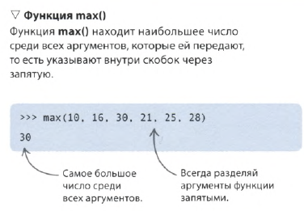
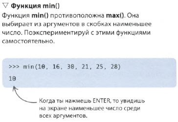
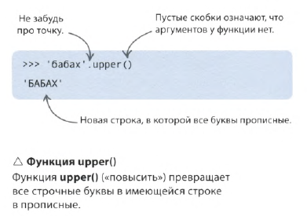
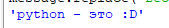

Дать имя куску кода, чтобы не повторять его - хорошая практика. При этом этут кусок можно вызывать по имени, и в скобках передавать если надо в этот кусочек кода нужные значения:
- Аргумент - значение в скобках, передается внутрь
- Возвращаемое значение - результат выполнения функции
- Вызвать - использовать функцию
- Создать/определить - использовать ключевое слово **def** при первичном описании функции
Итак, функцию создают, а потом вызывают, передавая ей аргументы.
 
## Встроенные функции
Python писали люди, соответственно часть функций уже описани (см. [Описание](../../_Commands/Ввод_вывод/print/Описание.md))

### max()
находит наибольшее число из переданных ей аргументов

### min()
 находит наименьшее число
 
### upper()
К некоторым функциям можно обратиться, прописав их через точку после переменной


### replace ()
Замена одного текста на другой
```python
message = 'python - это весело'
message.replace('весело', ':D')
```


### reverse ()
изменение порядка в списке значений
```python
i_countdown = [1, 2, 3]
s_countdown = ['one', 'two', 'three']
i_countdown.reverse()
s_countdown.reverse()
print(i_countdown)
print(s_countdown)
```