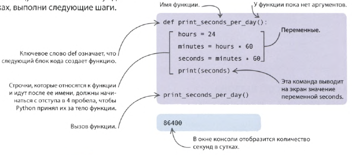

Функции должны быть определены до их использования в коде.
Строки кода функции должны начинаться с 4 пробелов

| Функция может выполнять какое-то действие                                                                                                                                           | Функция может возвращать значение                                                                                                                                                                           |
| ----------------------------------------------------------------------------------------------------------------------------------------------------------------------------------- | ----------------------------------------------------------------------------------------------------------------------------------------------------------------------------------------------------------- |
| def print_seconds_in_days(num):     hours = 24 * num     minutes = 60     seconds = hours * minutes * 60     print(seconds)       print_seconds_in_days(7)  | def convert_seconds_in_days(num):     hours = 24 * num     minutes = 60     seconds = hours * minutes * 60     return       total_sec = convert_seconds_in_days(7) print(total_sec) |

