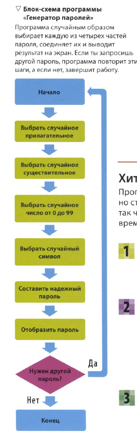

ка

|  | [[p54.py]]<br><br> |
| ------------------------------------------------- | ------------------ |


```python
import random
import string
oncemore = 'y'
def password():
    first_part = ['sleepy', 'slow', 'hot', 
    'cold', 'big', 'red', 'orange', 'yellow', 
    'green', 'blue', 'good', 'old', 'white', 
    'free', 'brave']
    second_part = ['apple', 'dinosaur', 'ball', 
    'cat', 'goat', 'dragon', 'car', 'duck', 'panda']    
    third_part = ['grow', 'sweem', 'run', 'eat', 
    'blow', 'select', 'go', 'GET', 'went']

    first = random.choice(first_part)
    second = random.choice(second_part)
    third = random.choice(third_part)
    number = random.randrange(0, 100)
    symbol = random.choice(string.punctuation)
    password = first + random.choice(string.punctuation) + \
    third + str(number) + second + random.choice(string.punctuation)
    return password  

print('Добро пожаловать! ')
print('Chhose one of three new password: ')
for counter in range (3):
    print (str(password()))  

while oncemore == 'y':
    oncemore = input('Once more (y/n)?')
    if oncemore == 'n':
        break
    else:
        print('Chhose one of three new password: ')
        for counter in range (3):
            print (str(password()))
```
