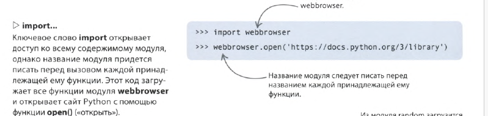
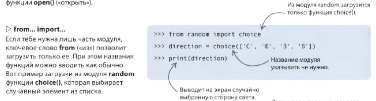
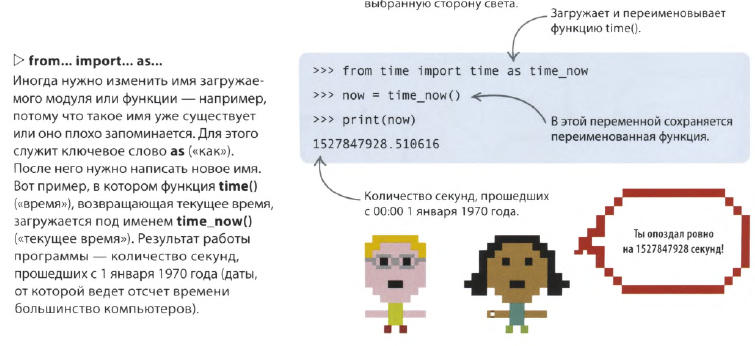

Модуль — это блок готового кода, который решает типовую задачу. Включив в программу модули, ты сможешь сосредоточиться на более интересных задачах. К тому же модулями пользуется много людей, и потому баги в них встречаются редко.

Для начала модуль нужно загрузить в программу с помощью команды import. Сделать это можно разными способами, в зависимости от того, как именно ты хочешь его использовать.



[[p59.py]]

```python
import webbrowser
webbrowser.open_new_tab('https://ya.ru')
```
Если загрузить лишь часть модуля, обращаться к нему можно только по имени функции, без указания модуля


[[p59_2.py]]
```python
from random import choice
direction = choice(['С', 'Ю', 'З', 'В'])
print(direction)
```

Импортированную функцию модуля можно переопределить, задав ей другое имя при импорте


[[p59_3.py]]
```python
from time import time as time_now
now = time_now()
print(now)
```


```python
```
```python
```
