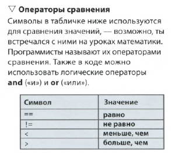
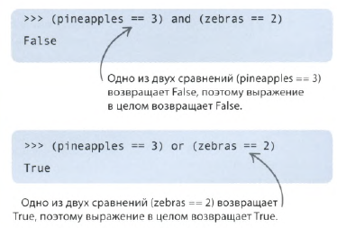
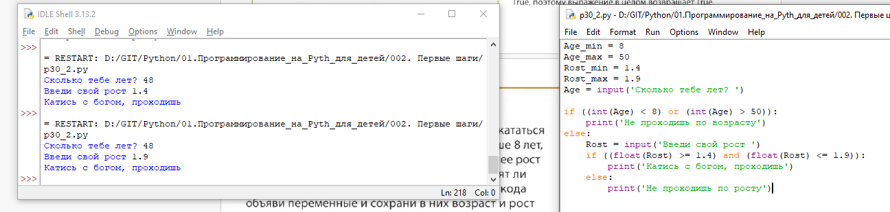
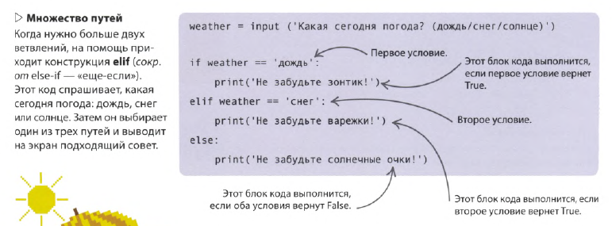
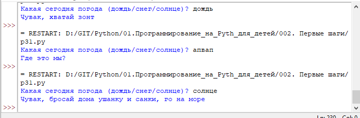

Символ **равно** - Очень интересный символ.
- ```=``` - присваиваем переменной значение
- ```==``` - используем при сравение двух значений или переменных
- ```!=``` - отрицание при сравнении: если значения не равны, то ИСТИНА


При сравнении получаем всегда одно из 2 значений:
- **TRUE**
- **FALSE**

Возможно множественное сравнение, при помощи операторов
- **AND** (оба значения должны быть истинными, если хотим получить TRUE)
- **OR** (хотя бы одно значение должно быть истинным, если хотим получить TRUE)

 Блок действий по результату сравнения размещаем между операторами условного исполнения **if...elif...else**

```
Age_min = 8
Age_max = 50
Rost_min = 1.4
Rost_max = 1.9
Age = input('Сколько тебе лет? ')

if ((int(Age) < 8) or (int(Age) > 50)):
    print('Не проходишь по возрасту')    
else:
    Rost = input('Введи свой рост ')
    if ((float(Rost) >= 1.4) and (float(Rost) <= 1.9)):
        print('Катись с богом, проходишь')
    else:
        print('Не проходишь по росту')
```





```
weather = input('Какая сегодня погода (дождь/снег/солнце)? ')
if weather == 'дождь':
    print('Чувак, хватай зонт')
elif weather == 'снег':
    print('Чувак, хватай ушанку и санки')
elif weather == 'солнце':
    print('Чувак, бросай дома ушанку и санки, го на море')
else:
    print('Где это мы?')
```

