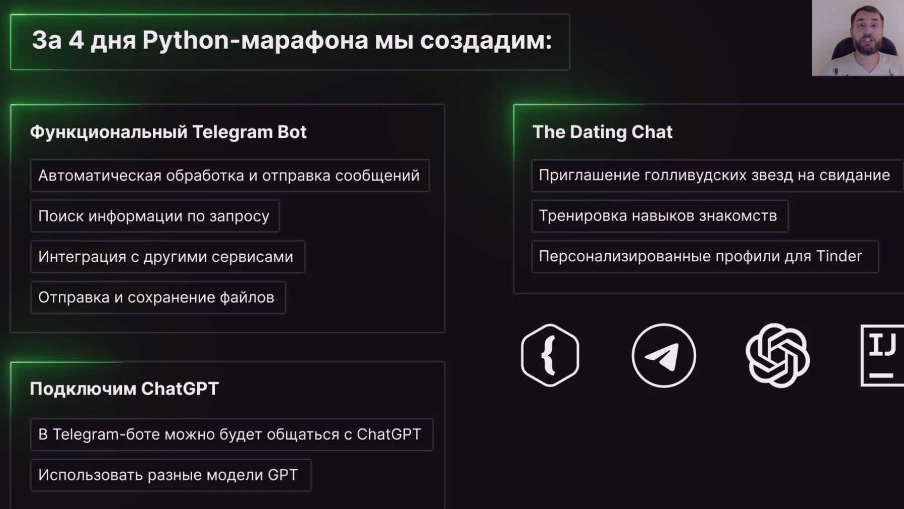

# ТЗ



ТГ-бот может общаться с другими
1. Общаться с чатом GPT
2. Генерить сообщения в Tinder
3. Помощник при переписке в Tinder

# Открываем шаблон проекта

Закрываем старый проект


Открываем новый


Можно задать интерпретатор


# Установка через интерпретатор библиотек


```
pip install python-telegram-bot
```
Если установка была проделана правильно, то все подчеркивания красным - уйдут. Следующая команда для установки библиотеки OpenAI

```
pip install openai
```


# Первый запуск

Все с ошибками, так как еще не получен Бот-токен


# Регистрация бота в ТГ

Через botfather


```
/newbot
...
TD_AI_bot_abc
...
TD_AI_bot_abc_bot
...
You will find it at t.me/TD_AI_bot_abc_bot. 
...
Use this token to access the HTTP API:
7655264179:AAE1LTOG7pDmaphBpFCmRE32rCF-uavuyxY
Keep your token secure and store it safely, it can be used by anyone to control your bot.
```


ТГ-токен - замена пары логин/пасс для ТГ


# Второй запуск

Уже без ошибок


И мы можем уже зайти в этого бота и посмотреть что с ним:


Можно нажать кнопку START, ничего не произойдет, написанного кода - нет
Добавим код, теперь печать любого слова в ТГ вызовет ответное приветствие


```
Важно! Слова async и await обязательно использовать, т.к. библиотека python-telegram-bot полностью асинхронная. Поэтому мы должны тоже писать асинхронные функции – и использовать ключевое слово async перед объявлением наших функций. Перед вызовом же асинхронной функции нужно обязательно писать ключевое слово await.  
```


## MD в ТГ


## Вывод в чат доп. информации
### Фото


 
### Кнопки


Чтобы при нажатии на кнопки что-то происходило - надо добавить хэндлер
 

### START


Исправляем ошибку


