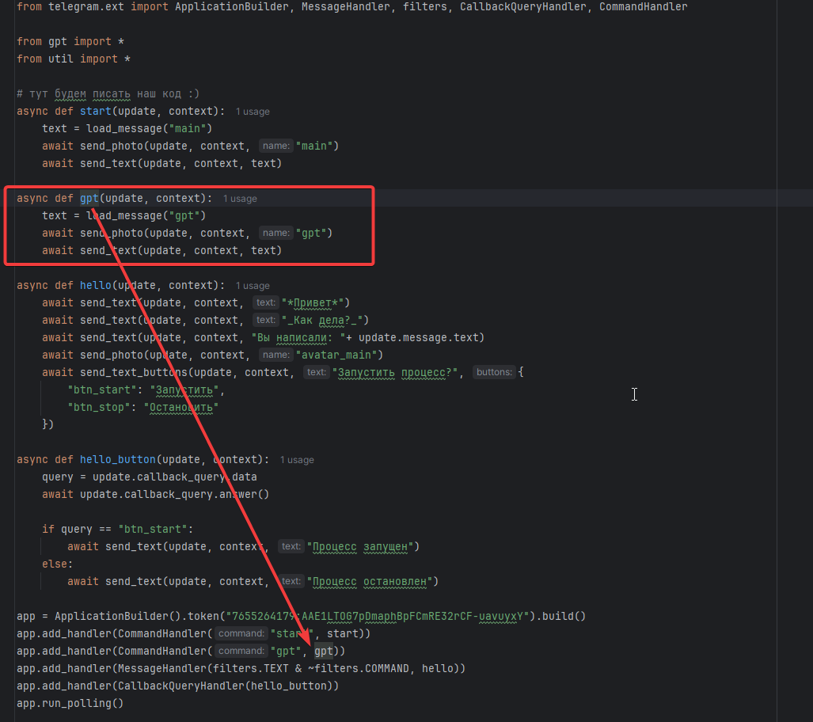

# Добавим немного GPT

Добавим определение функции gpt и хэндлер, который будет использовать функцию



Отвечает пока не сам GPT, а только код, который был написан днем ранее

# Контекст общения

Необходим чтобы бот различал режим общения, то есть контекст в рамках которого происходит общение


Укажем в функциях нужный контекст


И теперь научим бота обрабатывать ответ в рамках контекста в функции, которая описывает ответ бота на сообщение пользователя


# Ещё GPT

У GPT WEB - есть ограничения по количеству запросов. 
У GPT API - ограничений нет, но оплачивается трафик, который будет генериться вашим приложением.
Лучше использовать более дешевую модель, поэтому для публичных чатов используем


Чтобы прикрутить GPT, надо:
- знать токен (gpt:AgyOcazJ_9quXv71Cmo5u2qL1h_yytAiMaLywhYDr4xfoPUGP5gydVoBSJn5uc3GqTuBPJbtubJFkblB3TDn6T_un4buKEeUskeZ643kOrIteowKr2YUyjnyrDJyERTkMvgCT-Qm0H05svs_TEjdX546CNgN)


- создать объект чата GPT


- передать параметры в созданный объект через **prompt** - конструкцию используемую GPT для идентификации вопроса


результаты выполнения ответа на вопросы GPT


Бест практис - оформлять код ссылаясь на заране заполненные формулировки из текстовых файлов


# Заполнение MENU

Меню - такой объект, который используется для сокращения времени поиска по заявленным п.п. Меню


Для передачи в меню списка команд используется функция
```
async def show_main_menu(update: Update, context: ContextTypes.DEFAULT_TYPE, commands: dict)
```


