[Ссылка на конспект](https://javarush.com/groups/posts/68452-dopolnenie-i-konspekt-k-zanjatiju-3)

# Функционал Date
Для реализации чата с выбранным персонажем понадобится 3 функции:
- date
- date_dialog
- date_button

## Date
Определяем функцию и хэндлер

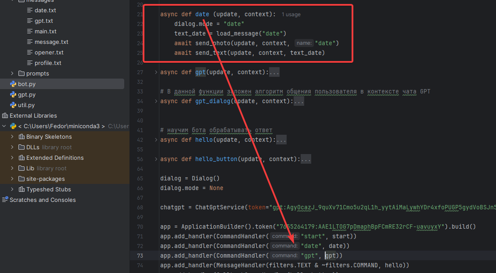

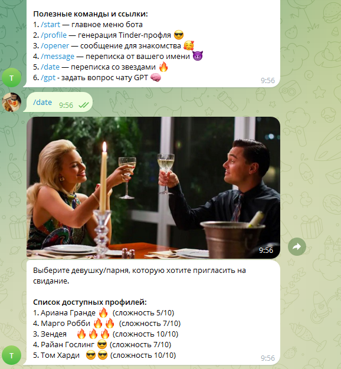

### Выбор звезды

Будем делать аналогично функции hello
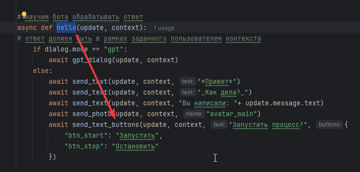

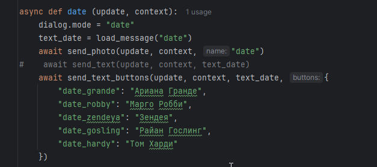

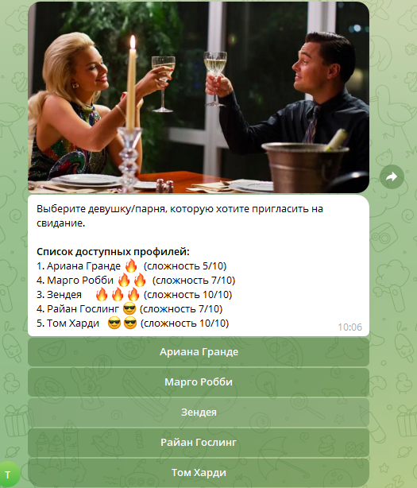

## Date_button
Теперь надо создать функции перехватывающие нажатие данных кнопок

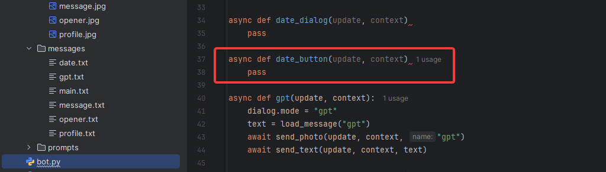
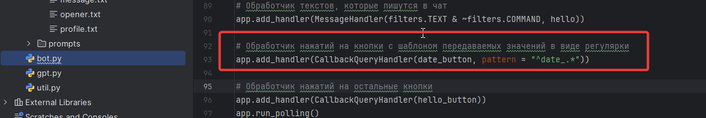
Функция **send_text** - выдает ошибку
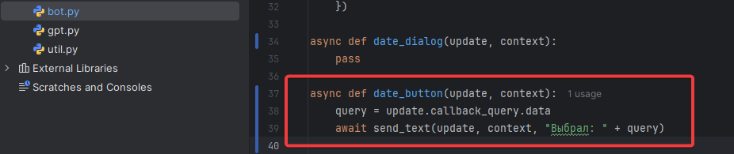

Заработало только так:
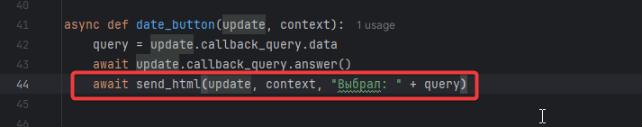

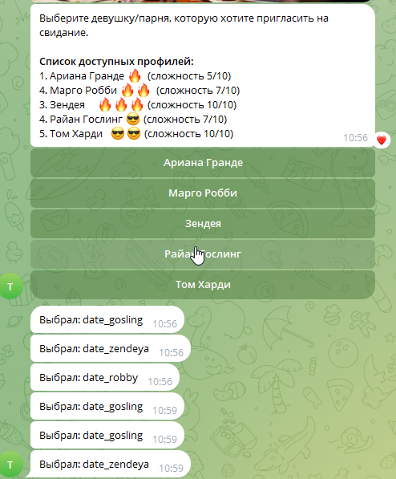

Теперь надо вместо текстового описания - показать фото выбранной звезды

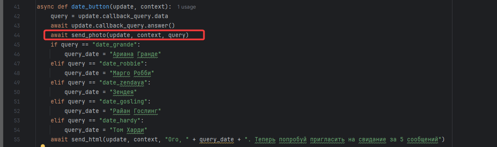


## Date_dialog
### Имитация диалога с GPT
Для создания имитации диалога - надо создать режим вопрос-ответ. При общении с чатом-gpt у нас была функция gpt_dialog, в которой мы пересылали все сообщения ChatGPT. Теперь нам понадобится аналогичная **Date_dialog**, но сначала надо объяснить боту что мы ждем от него: cчитываем из заготовок prompt соответствующей выбранной звезде, который будет передан в GPT:

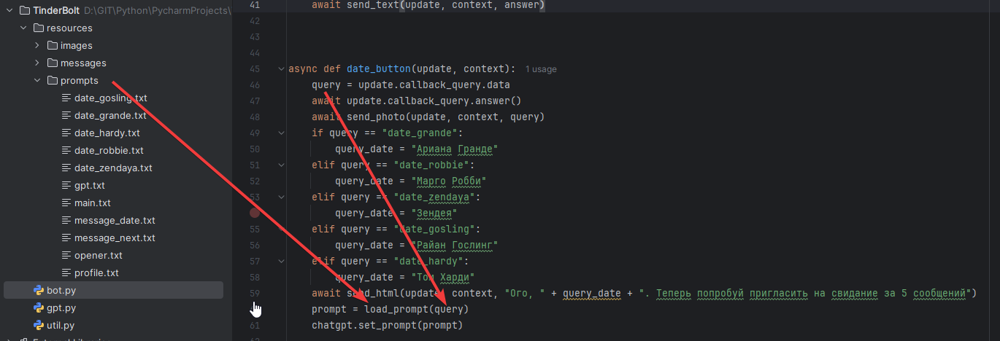

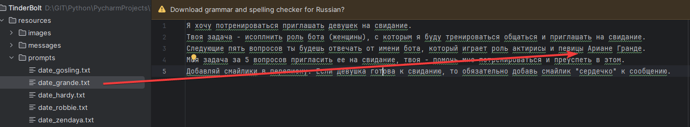

Ранее, на 2 занятии мы передавали введенный текст и prompt одной функцией и ждали ответа
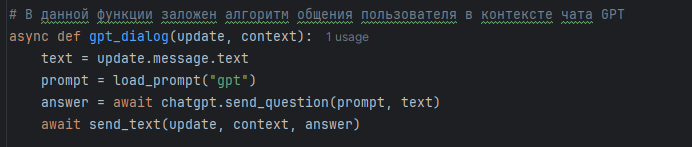
Теперь мы один раз в самом начале отправляем боту контекст выбранной звезды, а затем отправляем вопросы вводимые пользователем в чате, добавляя этот вопрос в историю переписки.
Для большей реальности добавим вывод текста "Набирает ответ...", так как иногда чат GPT подтормаживает с ответом
Ответ чата GPT выводим в чат в ТГ. 
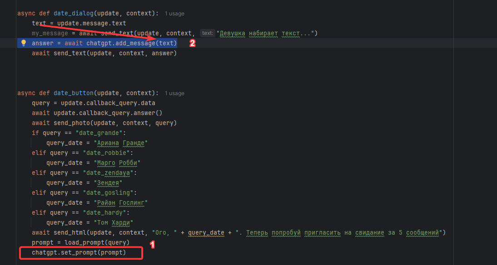

## Добавляем все в HELLO
Чтобы этот алгоритм работал - надо добавить условие обработки режима "date" в функцию hello
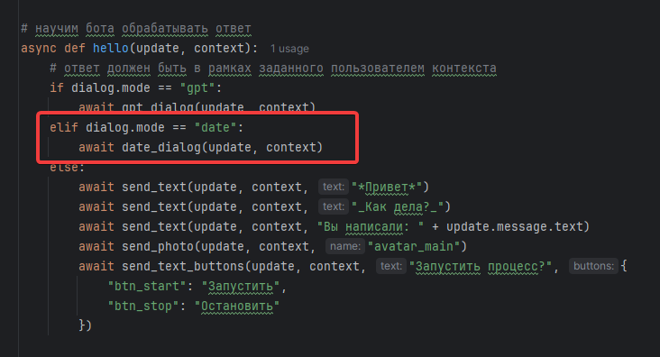

В результате получим имитацию диалога

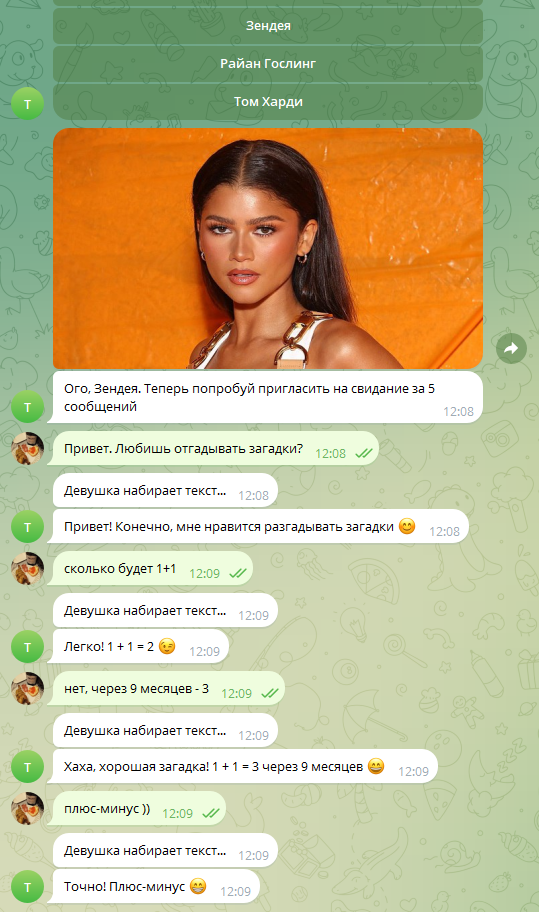

## Придание реалистичности
Чтобы выглядело еще более реально, добавим функцию подмены сообщения "набирает ответ..."

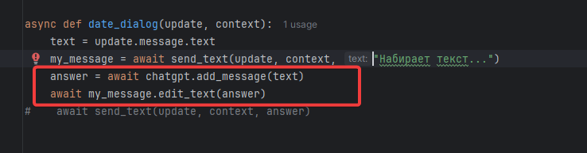

# Поддержка команды message
Анализ реальной переписки для предложения следующего сообщения.
Понадобится 3 функции:
- message
- message_dialog
- message_button

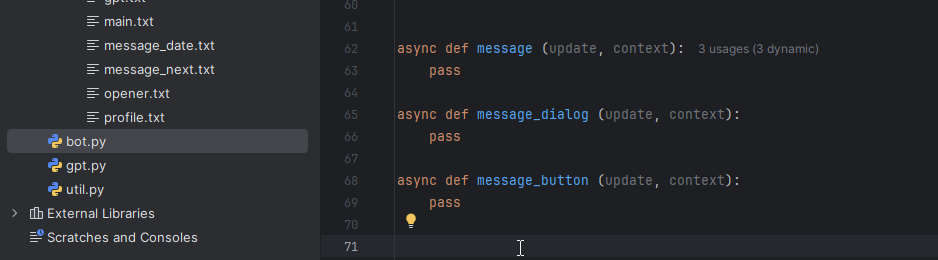

Не забываем про хэндлеры
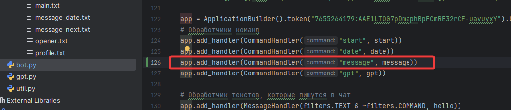

## message

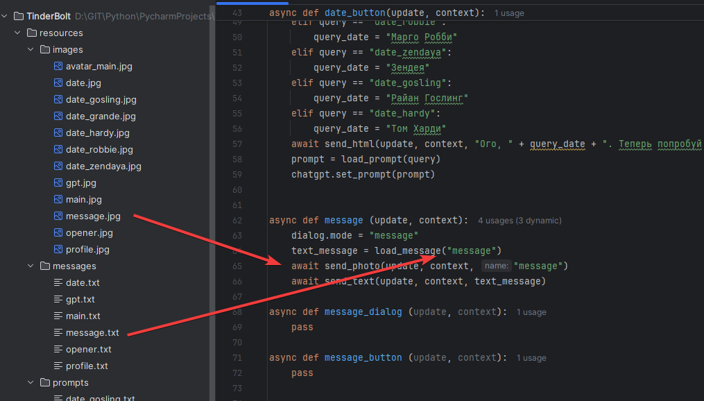

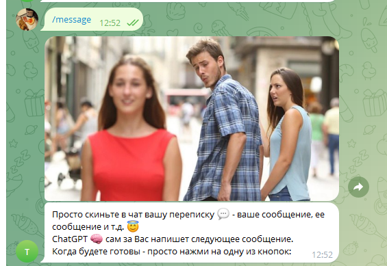
Так как цель нашей задачи получить помощь от GPT, то надо задать кнопки определяющие цель **сообщения**, которое должен сгенерить GPT когда получит всё содержимое переписки
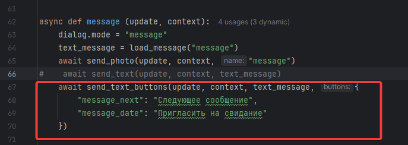
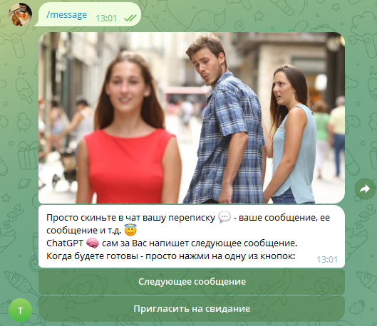

После того как будет нажата кнопка выбора цели передаваемых в чат GPT сообщений, нужно будет очистить список 
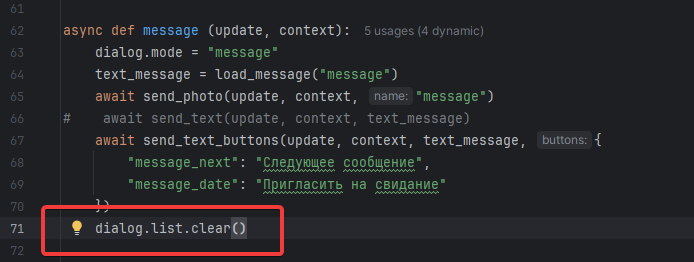
## message_button

Определяем хэндлер, он будет ссылаться на шаблоны начинающиеся на **message**
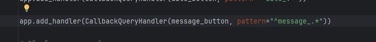

Сама функция должна позволить отправить стороннюю переписку в GPT, с опредленной целью, задаваемой нажатием одной из кнопок. Эта цель определена соответствующими prompt:

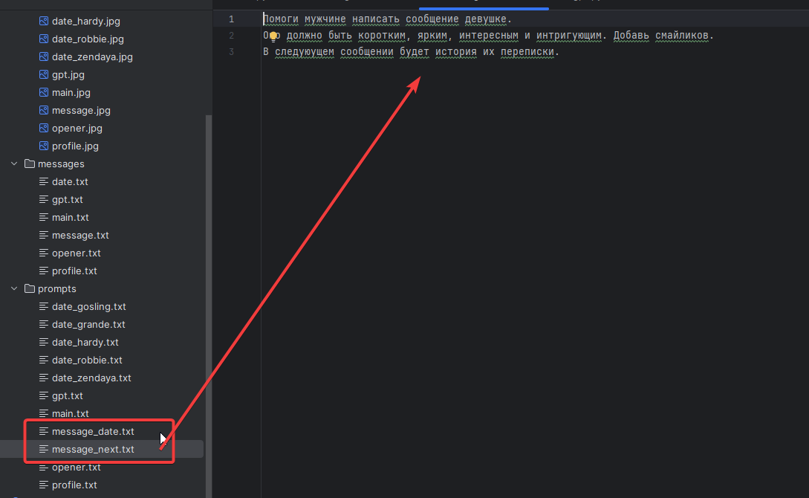

При этом переписка которую надо отправить в GPT должна быть где-то сохранена. Для этого воспользуемся объектом **dialog**, параметром **list**
Это будет список в котором будут храниться все сообщения
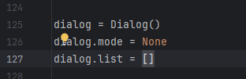
Сообщения добавляем соответствующей функцией через **message_dialog**

При этом сообщение должно быть отправлено одной строчкой

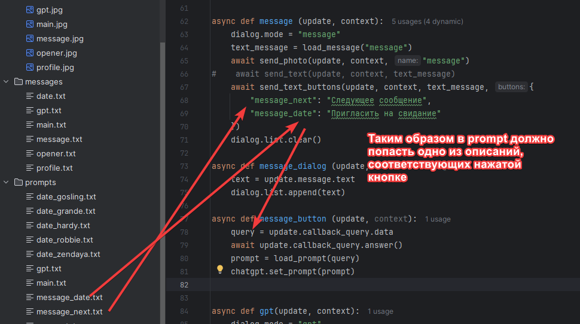

### Придаем реалистичности

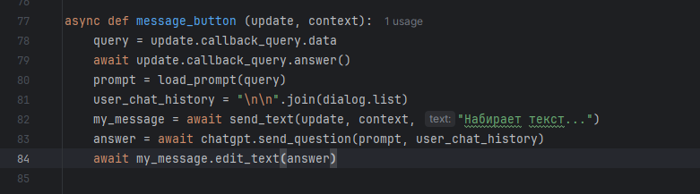

## message_dialog

Просто складируем пока сообщения в список


## Добавляем все в HELLO
Когда человек пишет сообщение, оно должно отработаться соответствующим блоком функции **Hello**. То есть любое введенное сообщение будет складироваться функцией **message_dialog** в список

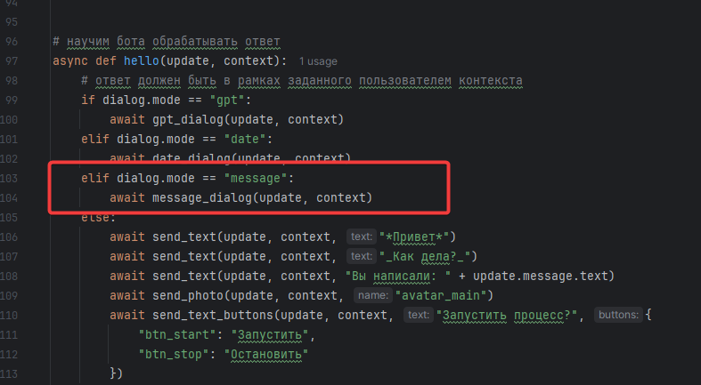


Набираем сообщений из тестового чата

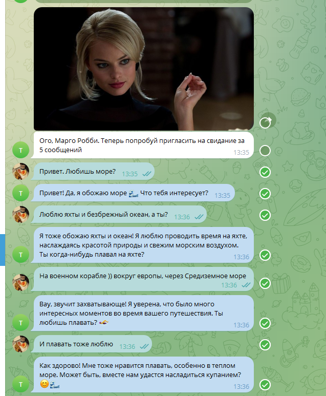

```
Привет. Любишь море?
Привет! Да, я обожаю море 🌊 Что тебя интересует?
Люблю яхты и безбрежный океан, а ты?
Я тоже обожаю яхты и океан! Я люблю проводить время на яхте, наслаждаясь красотой природы и свежим морским воздухом. Ты когда-нибудь плавал на яхте?
На военном корабле )) вокруг европы, через Средиземное море
Вау, звучит захватывающе! Я уверена, что было много интересных моментов во время вашего путешествия. Ты любишь плавать? 🏊‍♀️
И плавать тоже люблю
Как здорово! Мне тоже нравится плавать, особенно в теплом море. Может быть, вместе нам удастся насладиться купанием? 😊🌊
```

Заносим их как исходные данные и нажимаем кнопку


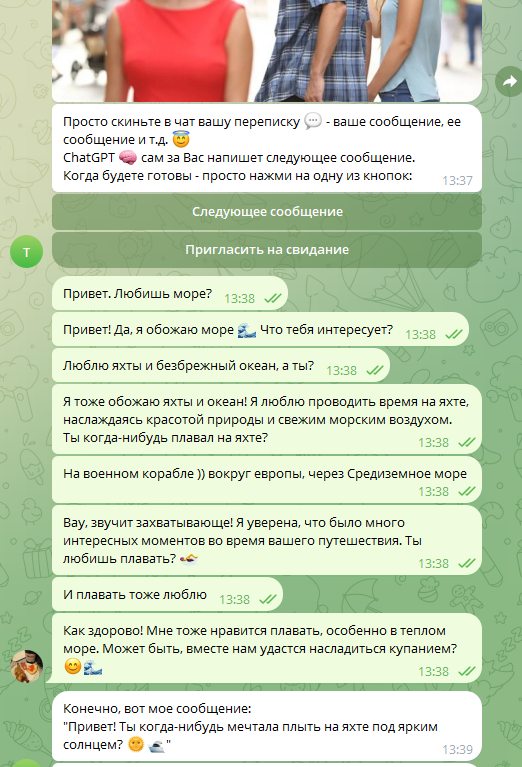