[Ссылка на конспект](https://javarush.com/groups/posts/68453-dopolnenie-i-konspekt-k-zanjatiju-4)
Осталось реализовать 2 команды:
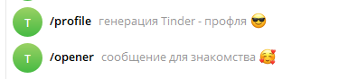
# Поддержка команды Profile
Для реализации функционала создания крутого профиля для Тиндер - понадобится 2 функции:
- Profile
- Profile_dialog

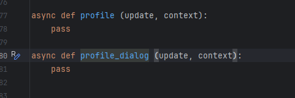
## Profile
Будем хранить информацию о пользователе  в объекте **dialog.user** - dictionary
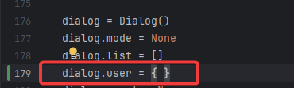
Определяем функцию и хэндлер
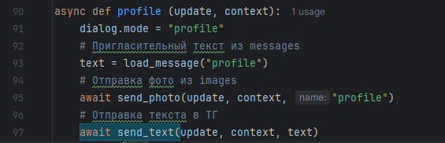
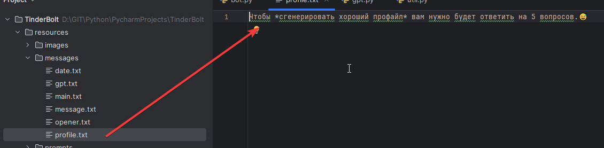

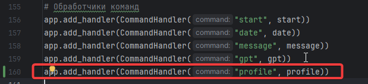

Тестируем
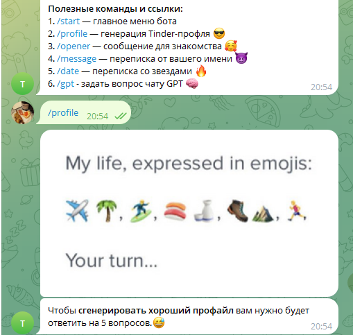


## Profile_dialog
Дальше нам будет необходимо сохранить переписку\ответы на вопросы для передачи в чат GPT. Будет 5 вопросов. Количество вопросов хранится в объекте **count**
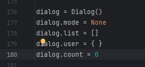
Для правильной передачи вводимых данных пользователем в нужные поля структуры dialog.user - изменим функцию **profile**
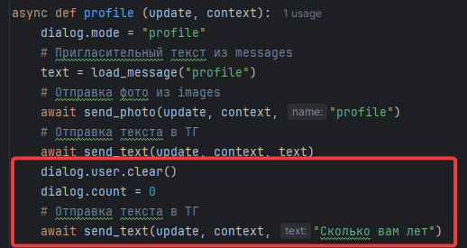
### Имитация диалога с GPT
Суть задачи - задать вопрос и одновременно сохранить ответ на прошлый вопрос
Испльзуя счетчик мы получаем возможность сохранять ответы пользователя в нужное поле структуры
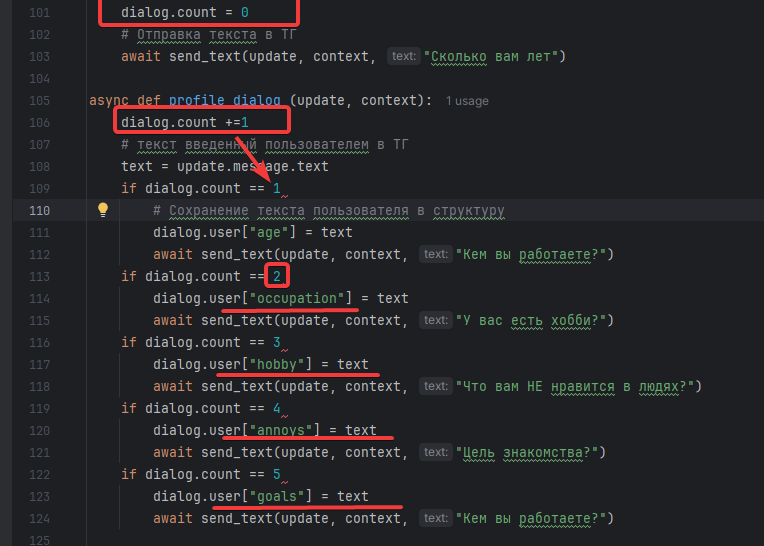

## Придание реалистичности
Теперь готовим собранную информацию для передачи в чат GPT
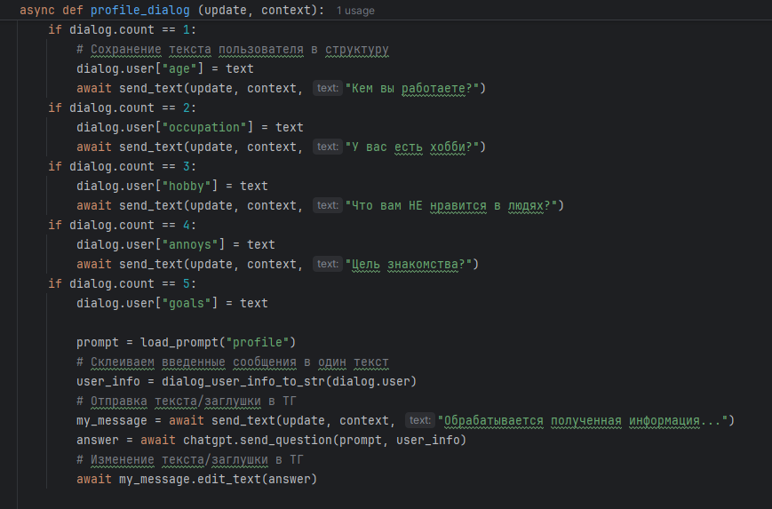
## Добавляем все в HELLO

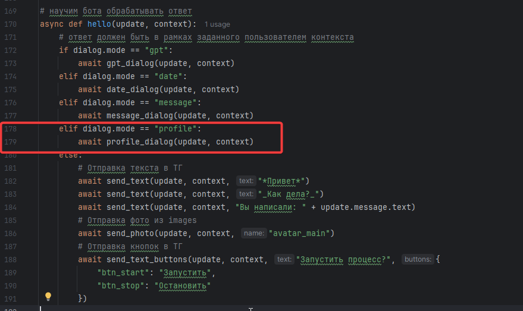


# Поддержка команды Opener
Данная техника поможет задать "нужные" вопросы человеку с которым вы переписываетесь
Понадобится 2 функции:
- Opener
- Opener_dialog

```
async def opener (update, context):  
    pass  
  
async def opener_dialog (update, context):  
    pass
```
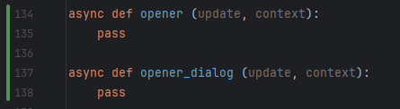

## Opener

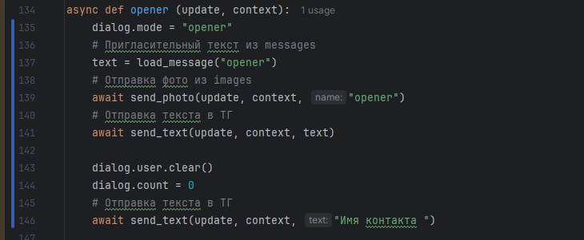

Не забываем про хэндлеры
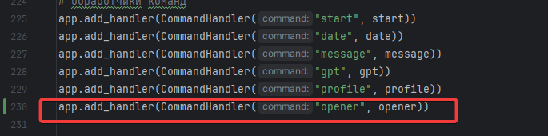
Добавляем все в HELLO
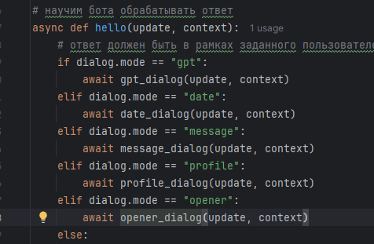
## Opener_dialog
строим аналогично **profile_dialog**
### Придаем реалистичности

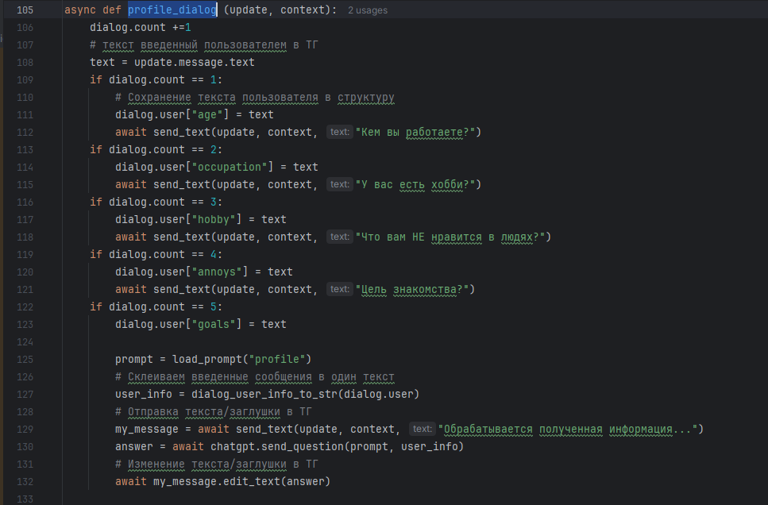
## Добавляем все в HELLO

