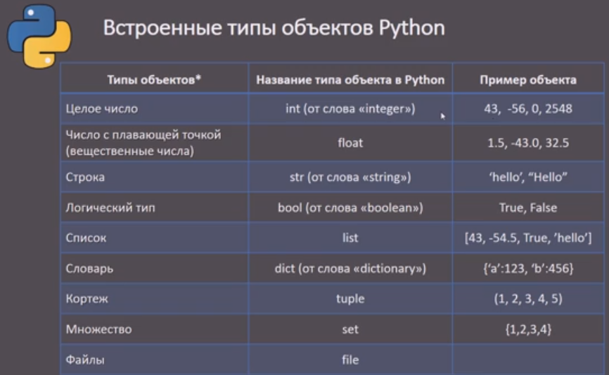
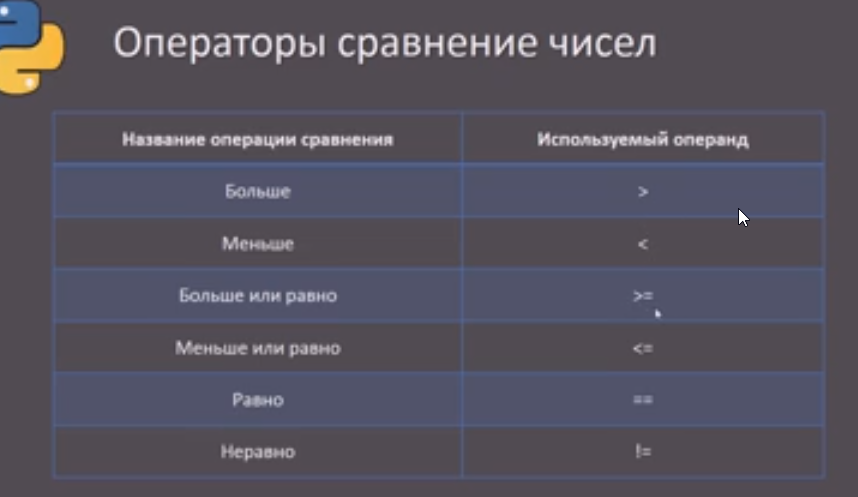
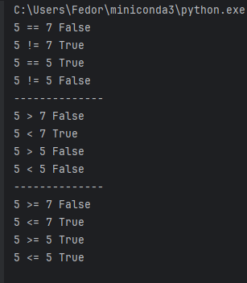
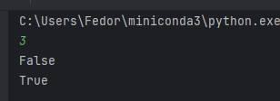
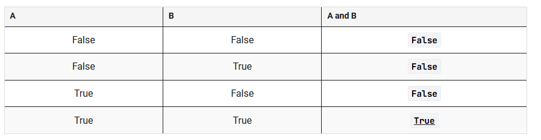
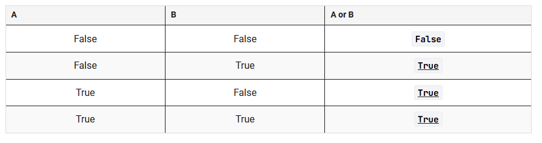
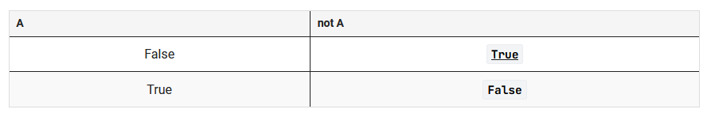
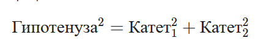

Встроенный тип данных **`bool`** в языке python может принимать только одно из двух значений:

-  **`True`** (Истина);
-  **`False`** (Ложь).
**Обязательно нужно писать данные значения с заглавной буквы.**

```python
print(type(False))  #<class 'bool'>
print(type(True))   #<class 'bool'>
```

результатом любого сравнения или условия будет значение логического типа: **`True`** или **`False`**.



Пример:
```python
a, b, c = 5, 7, 5  
print(a, '==', b, a == b)  
print(a, '!=', b, a != b)  
print(a, '==', c, a == c)  
print(a, '!=', c, a != c)  
  
print('--------------')  
print(a, '>', b, a == b)  
print(a, '<', b, a < b)  
print(a, '>', c, a > c)  
print(a, '<', c, a < c)  
  
print('--------------')  
print(a, '>=', b, a >= b)  
print(a, '<=', b, a <= b)  
print(a, '>=', c, a >= c)  
print(a, '<=', c, a <= c)
```



## проверка числа на положительность
. Для этого достаточно, чтобы число было больше нуля и остаток от деления на 2 был 0
```python
num = int(input())  
print(num%2 == 0)  
print(num%2 != 0)
```



## Условия операций сравнения
### Конъюнкция
`**Конъюнкция**` (логическое **И**) - это логическая операция, позволяющая объединить несколько условий в одно, результат которого будет истинным только тогда, _когда все входящие в конъюнкцию условия истинны_.



конъюнкция полезна в ситуациях, когда вам нужно одновременное выполнение нескольких условий. Например, ваш друг заявляет, что он пойдет на пробежку, если погода хорошая `**и**` у него будет свободное время. Пробежка в данном случае состоится только тогда, когда оба условия выполнятся.
```python
num = int(input())
print(num % 2 == 0 and num > 0)
...
num = int(input())
print(num >= 10 and num <= 30)
```
### Дизъюнкция
**`Дизъюнкция`** (логическое **ИЛИ**) - это логическая операция, позволяющая объединить несколько условий в одно, результат которого будет истинным, _когда хотя бы одно входящее в дизъюнкцию условие истинно_.


друг заявляет, что он пойдет в кино, если ему предоставят выходной `**или**` вы купите ему билет. В данном случае, чтобы пойти в кино, достаточно выполнения хотя бы одного из перечисленных условий.

### Инверсия

**`Инверсия`** (логическое отрицание, обозначается как **НЕ**) - это логическая операция, которая меняет значение условия на противоположное.

Проверка на четность у нас выглядела так:

```python
num = int(input())
print(num % 2 == 0)
```

а проверка на нечетность, следовательно, может выглядеть при помощи инверсии так:

```python
num = int(input())
print(not num % 2 == 0)
```

### Приоритет логических операций
Если нет скобок в условии, то порядок приоритетов от высокого к низкому выглядит следующим образом:

   1. **not** (логическое отрицание, инверсия)
   2. **and** (логическое И);
   3. **or** (логическое ИЛИ).

### Преобразование в логический тип данных
#### Из int/float в bool

Любое число в python может быть преобразовано в логическое значение при помощи одноименной функции `bool`. Во время преобразования используются следующие правила:

    **➖**  Значение `0` интерпретируется как `False`;
    **➖**  Все остальные значения (положительные и отрицательные) интерпретируются как `True`.
```python
print(bool(0))  # False
print(bool(1))  # True
print(bool(1.0))  # True
print(bool(-42))  # True
print(bool(345.3))  # True
print(bool(-123.35))  # True
```

#### Из bool в int
    **➖**  значение `**False**` преобразуется в `0`.
    **➖**  значение `**True**` преобразуется в `1`.

```python
print(int(True))   # 1
print(int(False))  # 0
```

#### Из str в bool

Любую строку можно преобразовать к логическому значению. Во время преобразования используются следующие правила:

    **➖**  Пустая строка (`""`) преобразуется в `False`;
    **➖**  Любая непустая строка (включая строки с пробелами) преобразуется в `True`.

```php
print(bool(""))       # False
print(bool("True"))   # True
print(bool("False"))  # True (даже строка "False" считается True, так как она не пустая)
print(bool("0"))      # True (не пустая строка)
print(bool(" "))      # True (строка с пробелами)
```

# Задачи
## 1 вывести **`True`**, если введенное значение является положительным числом, в противном случае - **`False`**
На вход поступает целое число. Программа должна вывести **`True`**, если введенное значение является положительным числом, в противном случае - **`False`**.
Сделать задачу необходимо без использования условного оператора.
```python
num = int(input())
print(num > 0)
```

## 2 вывести **`True`**, если введенное значение является четным числом, в противном случае - **`False`**.
На вход поступает целое число. Программа должна вывести **`True`**, если введенное значение является четным числом, в противном случае - **`False`**.
Сделать задачу необходимо без использования условного оператора.
```python
num = int(input())
print(num % 2 == 0)
```

## 3 Программа должна вывести **`True`**, если введенное значение кратно 6 (без остатка делится на 6), в противном случае - **`False
На вход поступает целое число. Программа должна вывести **`True`**, если введенное значение кратно 6 (без остатка делится на 6), в противном случае - **`False`**
Сделать задачу необходимо без использования условного оператора.
```python
num = int(input())
print(num % 6 == 0)
```

## 4  вывести **`True`**, если введенное значение не кратно 9, в противном случае - **`False`**.
На вход поступает целое число. Программа должна вывести **`True`**, если введенное значение не кратно 9, в противном случае - **`False`**.
Сделать задачу необходимо без использования условного оператора.
```python
num = int(input())
print(num % 9 != 0)
```

## 5 вывести **`True`**, если у введенного числа последняя цифра 2, в противном случае - **`False`**.
На вход поступает целое положительное число. Программа должна вывести **`True`**, если у введенного числа последняя цифра 2, в противном случае - **`False`**.
Сделать задачу необходимо без использования условного оператора.

```python
num = int(input())
print(num % 10 == 2)
```

## 7 вывести **`True`**, если оба числа делятся на 7 без остатка, в противном случае - **`False`**.
поступают два целых числа в одной строке. Программа должна вывести **`True`**, если оба числа делятся на 7 без остатка, в противном случае - **`False`**.
Сделать задачу необходимо без использования условного оператора.
```python
num1, num2 = map(int, input().split())
print(num1%7 == 0 and num2%7 == 0)
```

## 8 вывести **`True`**, если данные стороны образуют правильный треугольник, в противном случае - **`False`**.
На вход поступают три целых числа - стороны треугольника. Необходимо вывести **`True`**, если данные стороны образуют правильный треугольник, в противном случае - **`False`**.
_Правильный треугольник (равносторонний, равноугольный) — треугольник, все стороны которого равны между собой._
Сделать задачу необходимо без использования условного оператора.
```python
st1, st2, st3 = map(int, input().split())
print(st1 == st2 and st1==st3)
```

## 9 вывести **`True`**, если введенное значение принадлежит интервалу от 5 не включительно до 19 включительно
На вход поступает целое число. Программа должна вывести **`True`**, если введенное значение принадлежит интервалу от 5 не включительно до 19 включительно, в противном случае - **`False`**.
Сделать задачу необходимо без использования условного оператора.
```python
num = int(input())
print(num > 5 and num <=19)
```

## 10
На вход поступают два слова. Программа должна вывести **`True`**, если хотя бы одно слово равно слову «awesome».
Сделать задачу необходимо без использования условного оператора.

```python
w1 = str(input())
w2 = str(input())
print(w1 == "awesome" or w2  == "awesome")
```

## 11
Программа получает **три натуральных числа** `a`, `b`, `c`  в одной строке — стороны треугольника. Программа должна вывести:
- `True`, если можно ли составить треугольник с такими сторонами;       
- `False`, если треугольника с такими сторонами не существует.

📌 **Теорема о существовании треугольника:**
       Треугольник существует, если **сумма любых двух сторон больше третьей**:
**a+b>c,  a+c>b,   b+c>a**

```python
a, b, c = map(int, input().split())
print(a + b > c and a + c > b and b + c > a)
```

## 12

На вход поступает целое положительное число. Программа должна вывести **`True`**, если данное число является двузначным, в противном случае - **`False`**.
Сделать задачу необходимо без использования условного оператора.

```python
a = int(input()) 
print(9 < a <= 99)

```

## 13
На вход поступают три целых числа — **стороны треугольника** (в произвольном порядке). Ваша задача — проверить, образуют ли эти стороны **прямоугольный треугольник**.
Программа должна вывести:
- `True`, если данные стороны образуют **прямоугольный треугольник**;       
- `False`, если **не образуют**.
Для проверки вам пригодится теорема Пифагора:


```python
a, b, c = map(int, input().split())
print(pow(a,2) + pow(b,2) == pow(c,2) or \
    pow(b,2) + pow(c,2) == pow(a,2) \
    or pow(c,2) + pow(a,2) == pow(b,2))

вот более оригинальный способ

a,b,c = map(int, input().split())
l = [a,b,c]
g = max(l)
l.remove(g)
print( pow(g,2) == pow(l[0],2) + pow(l[1],2))
```