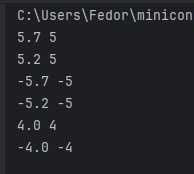
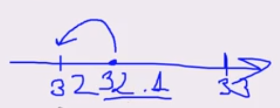
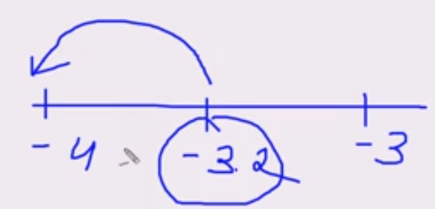
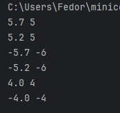
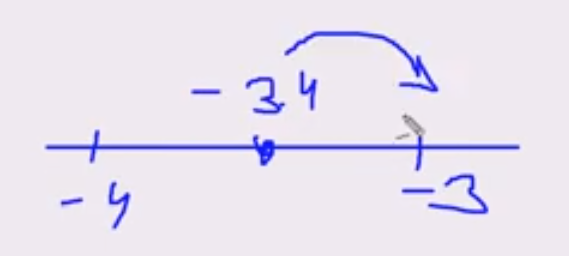
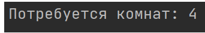

данные команды содержатся в модуле **math**

# trunc
отсекает дробную часть числа (как положительнаго, так и отрицательного)
Если использовать функцию **int**, то произойдет аналогичное отсечение дробной части

```python
import math
math.trunc(32.3) #32
...
import math  
print(5.7, math.trunc(5.7))     #  5.7   5
print(5.2, math.trunc(5.2))     #  5.2   5
print(-5.7, math.trunc(-5.7))   # -5.7  -5
print(-5.2, math.trunc(-5.2))   # -5.2  -5
print(4.0, math.trunc(4.0))     #  4.0   4 
print(-4.0, math.trunc(-4.0))   # -4.0  -4
```



# floor
Округление вниз
- если у числа **`x`** отсутствует дробная часть, результатом будет само число **`x`** в виде целого значения;
- если число **`x`** положительное, его дробная часть будет отброшена;
- если число **`x`** отрицательное, дробная часть также будет отброшена, но целая часть уменьшится на единицу.



```python
import math
math.floor(32.1) #32
```



```python
import math
math.floor(-3.2) #4 

print(5.7, math.floor(5.7))       #  5.7   5
print(5.2, math.floor(5.2))       #  5.2   5
print(-5.7, math.floor(-5.7))     # -5.7  -6  
print(-5.2, math.floor(-5.2))     # -5.2  -6  
print(4.0, math.floor(4.0))       #  4.0   4  
print(-4.0, math.floor(-4.0))     # -4.0  -4  
```


Пример применения функции **`math.floor()`**. Представьте, что нам нужно определить, какое максимальное количество товаров можно купить на заданную сумму денег. Товар продаётся только целыми единицами, и дробное количество приобрести нельзя. Решение выглядит так:

```python
import math

budget = 50.5
price = 15.3 
items = math.floor(budget / price)
print("Количество товаров:", items)
```
# ceil
Округление вверх




```python
import math
math.ceil(4.0000001) # 5
```

- если у числа **`x`** отсутствует дробная часть, то результатом будет само число **`x`** в виде целого значения;
- если число **`x`** положительное, его дробная часть будет отброшена, а целая часть увеличится на единицу;
- если число **`x`** отрицательное, его дробная часть будет отброшена.

Функция **`math.ceil()`** часто используется для округления вверх при расчёте дополнительных ресурсов. К примеру, нужно рассчитать, сколько комнат, вмещающих в себя пять человек, потребуется для размещения 18 студентов. Вот код решения:

```lua
import math

students = 18
chairs_per_room = 5
rooms_needed = math.ceil(students / chairs_per_room)
print("Потребуется комнат:", rooms_needed)
```
Запустив программу,  мы увидим 



что для такого количества студентов потребуется 4 комнаты, поскольку студенты не могут делить комнату с точностью до долей, округление должно выполняться вверх.
# Внимание
[](https://stepik.org/users/702392392)

[Nikolay Barkalov](https://stepik.org/users/702392392)

last month

trunc vs. int

В большинстве случаев для приведения числа с плавающей запятой (типа `float`) к целому числу (`int`) действительно нет особой разницы между использованием `int()` и `math.trunc()`, так как оба метода отбрасывают дробную часть, сохраняя целую часть числа. Однако есть несколько нюансов, которые могут повлиять на выбор то, что использовать:

1. **Поддерживаемые типы**:
    
    - `int()` может принимать не только числа, но и строки, которые можно преобразовать в целое (например, `int("10")`).
    - `math.trunc()` принимает только числа, и если передать ему строку, то возникнет ошибка.
2. **Читаемость**:
    
    - В зависимости от контекста, `math.trunc()` может быть более очевидным для других разработчиков, указывая на то, что вы явно хотите отрезать дробную часть числа. Это может быть полезно, если вы хотите сделать ваш код более читаемым.
3. **Кросс-совместимость**:
    
    - Если вы работаете с функциями, библиотеками или кодом, который предполагает использование `math.trunc()` (например, в приложениях, связанных с математическими расчетами), лучше использовать именно его для соответствия стилю кода.
4. **Оптимизация**:
    
    - В общем смысле `int()` может быть немного быстрее в Python, поскольку он встроен в язык и не требует дополнительного импорта, но на практике разница в производительности, скорее всего, будет незначительной.
5. **Проблемы с округлением**:
    
    - Если в вашем коде существует мнение о том, что вы не хотите смешивать поведение `int()` и `trunc()`, возможно, это также является аргументом в пользу выбора одного из методов.


# 1
Портос хочет украсить золотым шитьем свою перевязь. Он знает, что один сантиметр золотого шитья стоит один луидор. Портосу надо вышить N миллиметров перевязи. Причем мастер никогда не возьмется за работу, если ему заплатят меньше, чем стоит работа. И сдачу мастер никогда не отдает.
Какое минимальное количество луидоров Портос должен заплатить мастеру за работу?

## Входные данные
Программе на вход поступает натуральное число N (N ≤ 109) – длина перевязи в миллиметрах.
## Выходные данные
Выведите на экран минимальное количество луидоров, которые Портос должен отдать за работу.

```python
import math
num = int(input())
print(math.ceil(num/10))
```
# 2
После вечеринки компания из `N` человек хочет добраться домой с помощью такси. Максимальное количество человек, которое может уместиться в машину, равно 4. Сколько машин придется вызвать ребятам, чтобы все могли уехать?

Программа получает на вход положительное целое число `N` - количество человек в компании.

```python
import math  
num = int(input())  
print(math.ceil(num/4))
```

# 3
В некоторой школе решили набрать три новых математических класса и оборудовать кабинеты для них новыми партами. За каждой партой может сидеть два учащихся. Известно количество учащихся в каждом из трех классов. Выведите наименьшее число парт, которое нужно приобрести для них. 

Программа получает на вход три натуральных числа: количество учащихся в каждом из трех классов (числа не превышают 1000).

```python
import math
class1 = int(input())
class2 = int(input())
class3 = int(input())
print(math.ceil(class1/2) + math.ceil(class2/2) + math.ceil(class3/2))
```

# 4 
Ваш дядя — владелец фирмы, которая занимается ремонтом офисов. Он заподозрил, что бригадир закупает слишком много краски, и попросил вас разобраться.

Ваша задача — написать программу, которая рассчитывает минимальное количество банок краски, необходимых для покраски стен офиса. Длина офиса — **`L`** метров, ширина — **`W`** метров, высота — **`H`** метров. Одна банка краски покрывает 16 м² поверхности. Размеры дверей и окон можно игнорировать.

```python
import math
l = int(input())
w = int(input())
h = int(input())
print(ceil((2*l*h + 2*w*h)/16))
```