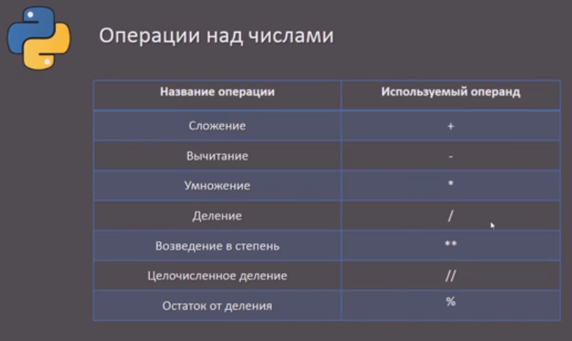
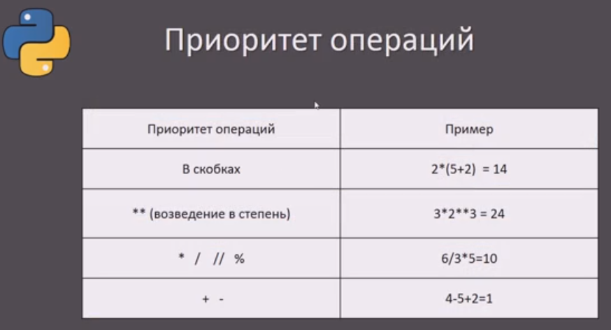
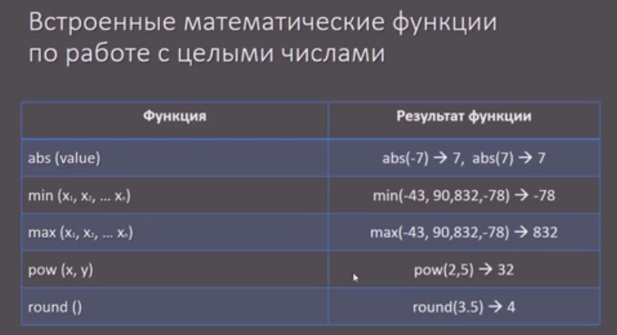
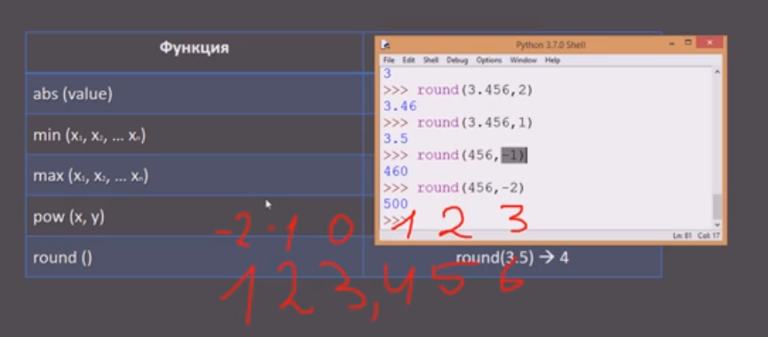
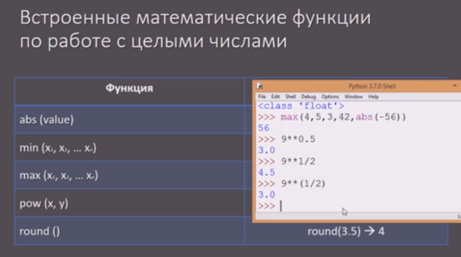
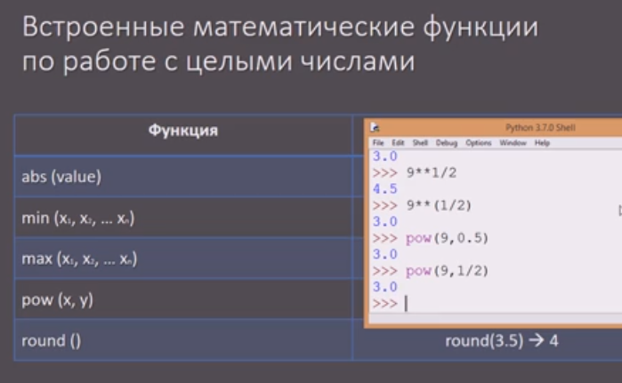

9 встроенных типов данных (ЦЧ, ЧПТ, СТР, ЛОГ/BOOL, СПИС/LST, СЛОВ/DICT, КОРТ/0TUPLE, МН-ВО/SET, ФС/FLS)






5 встроенных матем. ф-ций (ABS, MIN, MAX, POW, ROUND)


Разряды при округлении МИНУС БКЧ-0-ЗПТ-ПЛЮС БКЧ





# Библиотека
``` python
imp math
```
