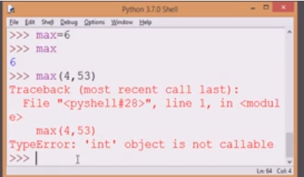
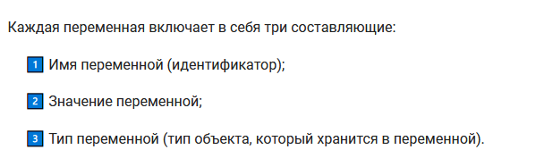
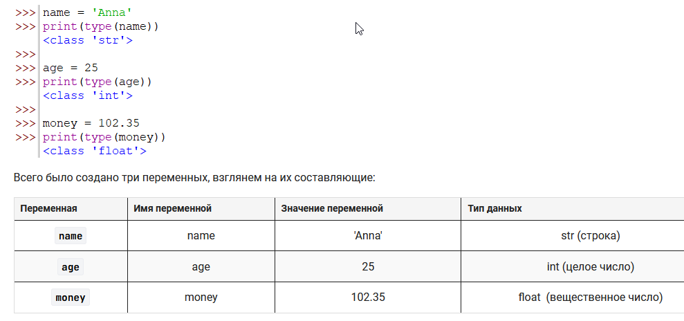
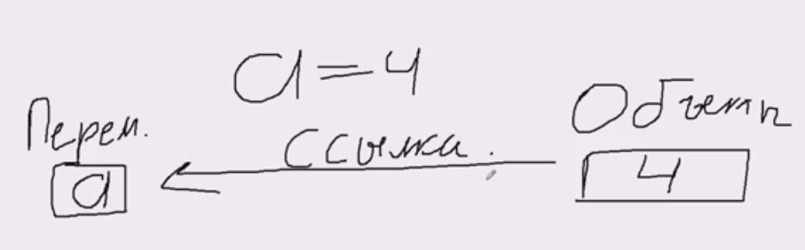
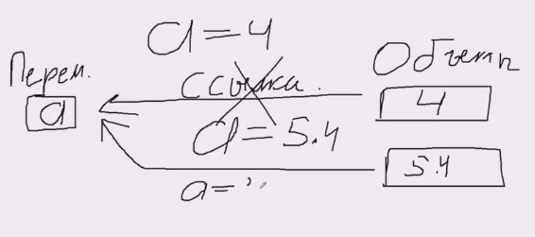
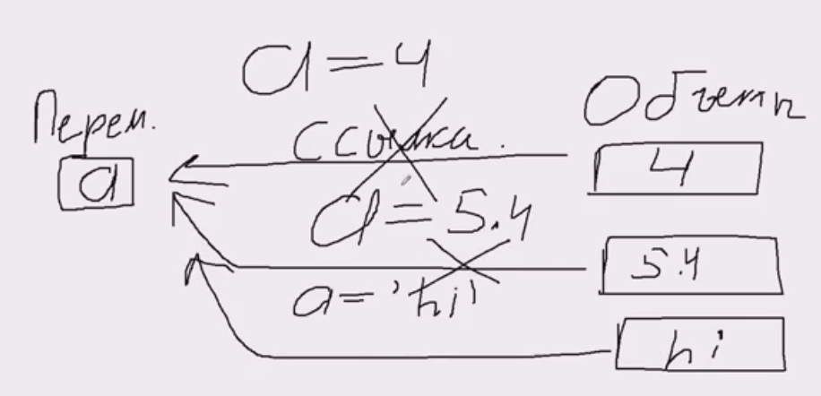
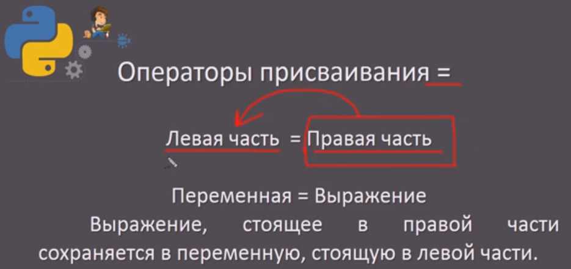
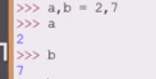
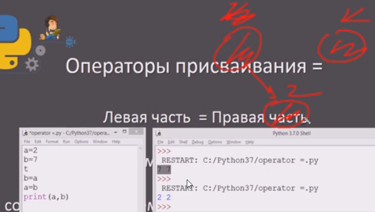
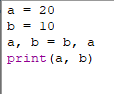

Переменная создается при инициализации.
Переменная должна начинаться с буквы или символа ```_```
Питон чувствителен к регистру букв
Не допускается создание переменной с именем ключевых слов


Если случайно задали имя переменной по имени функции, то больше обращаться к этой функции будет нельзя


# Что под капотом
На картинке ниже показано что именно происходит, когда мы хотим переменную проинициализировать значением:
- создается объект
- создается переменная
- в переменную передается ссылка на объект





При присвоении переменой нового значения в переменную прилетит ссылка на новый объект
Ну и наконец, в переменную можно положит значение другого типа, это означает что в переменной всего лишь появится ссылка на объект другого типа


Адрес объекта можно также узнать через функцию ```id```


## Динамическая типизация
"динамической типизацией" - переменная может принимать значения любых типов


## Строгая типизация
Используется в паскале, не в питоне

## Оператор присваивания
Ссылка на результат вычисления правой части через этот оператор присваивания переменной


Питон позволяет инициализировать одной ссылкой на объект несколько переменных сразу


Также можно инициализировать сразу несколько переменных разными значениями через ```,```


Интересная ситуация с передачей значений между переменными 

Выше - способ с использование 3-й переменной

Еще 1 способ
```python
a = 20 
b = 10 
a, b = b, a 
print(a, b)

```

