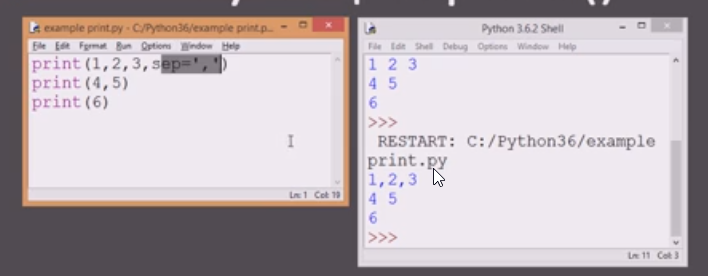
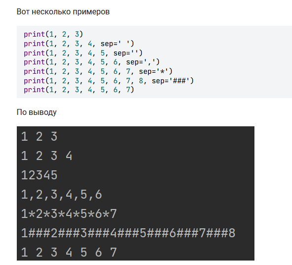
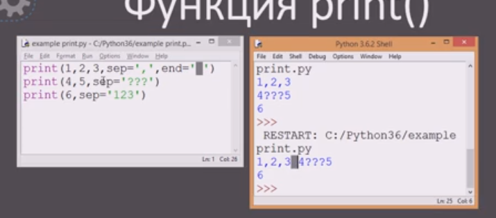
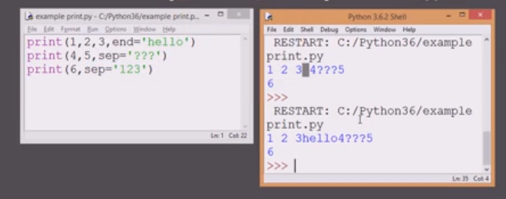
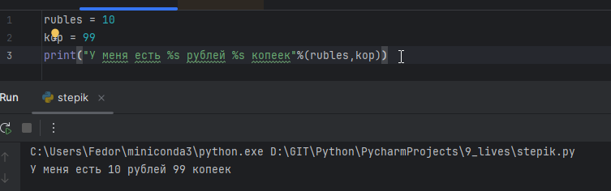
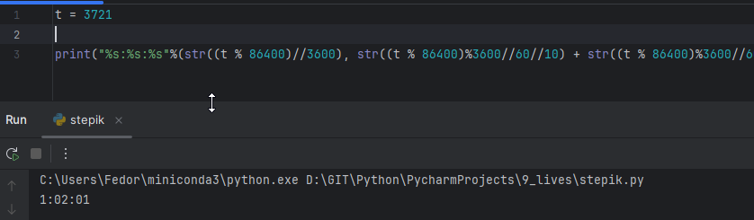
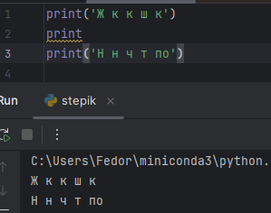

# SEP (separator)
Основное внимание разделителю SEP (separator). По-умолчанию это пробел, но его можно переопределить, но это не повлияет на разделитель в дальнейших командах




```python
a, b, c = map(int, input().split())
print(a,b,c, sep = ",")

или 
l = list(map(int, input().split()))
s = str(l[:]).strip('[]')
s1 = s.replace(', ', ',')
print(s1)
```
# END
Символ в конце строки, по-умолчанию это ``` \n``` - перенос строки. Пустой принт вызовет дополнительный перенос строки
Если его переопределить на, допустим, пробел, - то следующая строка  не будет перенесена


Вместо символа переноса строки, можно задать любые символы



# Символы в тексте

При печати допускается использовать подстановку следующей конструкцией:
```python
rubles = 10  
kop = 99  
print("У меня есть %s рублей %s копеек"%(rubles,kop))
```



```python
t = 3721  
print("%s:%s:%s"%(str((t % 86400)//3600), str((t % 86400)%3600//60//10) + str((t % 86400)%3600//60%10), str((t % 86400)%3600%60//10) + str((t % 86400)%3600%60%10)))
```

# print без скобок

```python
print('Ж к к ш к')  
print  
print('Н н ч т по')
```
Оператор 2 строчки не будет учитваться и не будет переноса строки


# 1 считывает натуральное число `n`, после чего выводит двойное неравенство этого числа с его соседними числами.

```python
a = int(input())
print(f"{a-1}<{a}<{a+1}")
```


# 2 вывести три фразы, разделяя их тремя дефисами

```python
l = []
l.append(input())
l.append(input())
l.append(input())
s = str(l[:]).strip("[]'").replace("', '", "---")
print(s)
```

# 3 вывести строку с заданным разделителем

```python
s = str(input())
l = [1,2,3,4,5]
n = 0
while n < len(l)-1:
    print(f"{l[n]}".strip("[]"), end = s)
    n = n + 1
print(f"{l[n]}".strip("[]"))  
```

# 4 Выводит **то же самое предложение**, но в конце добавляет `"Сказала она!"`
```python
s = str(input())
eostr = " - Сказала она!"
print(s, end = eostr)
```
