# деление нацело 
деление нацело в питоне - ``` // ``` дает результат деления до запятой (дробной части). Причем результат деления - всегда целое число


# деление по остатку 
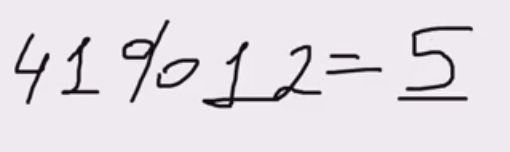

деление по остатку можно использовать при анализе арифметических рядов:
- 8, 15, 22, 29... - дают при %7 = 1
- 10, 17, 24, 31... - дают при %7 = 3

Таким образом рассмотренные операторы - дают возможность выяснить из каких цифр состоит число.

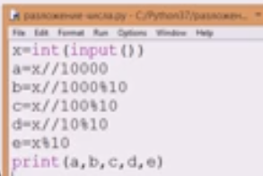


Пример
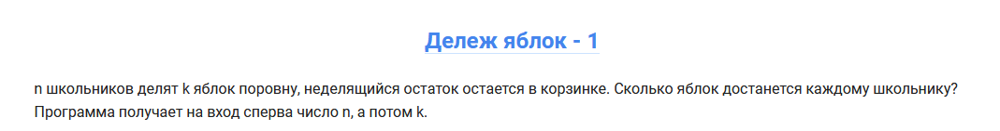
```python
n = int(input())
k = int(input())
print(int(k // n))
```

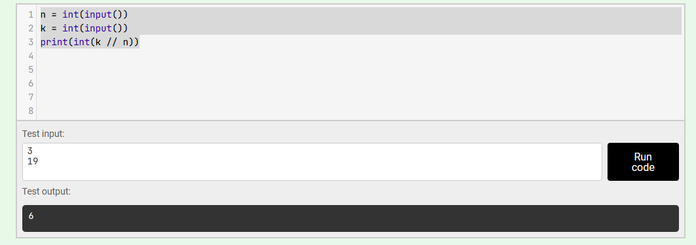

Пример: 
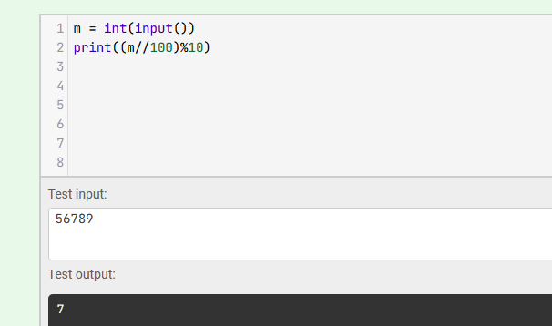

Пример:
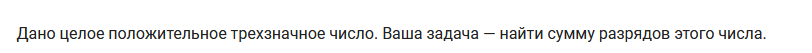
```python
n = int(input())
print(int(n%10)+int(n//10%10)+int(n//100%10))
```

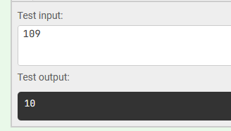

Пример: вычисление сколько прошло часов и минут с начала суток
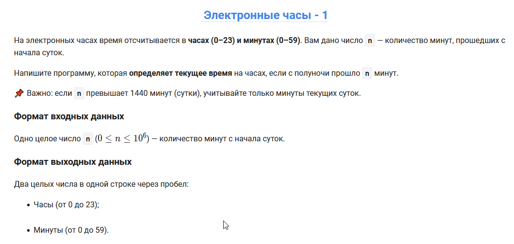

```python
t = 608862  
print((t % 1440)//60, (t % 1440)%60, end = " ")
```

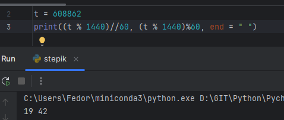

Пример: вычисления минимального числа купюр, которым можно выдать запрошенную сумму
```python
t = 608862  
print("100 - %s, 20 - %s, 10 - %s, 5 - %s, 1 - %s"%((t // 100),((t % 100) // 20),(((t % 100) % 20) // 10),((((t % 100) % 20) % 10) // 5),(((((t % 100) % 20) % 10) % 5) // 1)))  
print((t // 100) + ((t % 100) // 20) + (((t % 100) % 20) // 10) + ((((t % 100) % 20) % 10) // 5) + (((((t % 100) % 20) % 10) % 5) // 1))
```

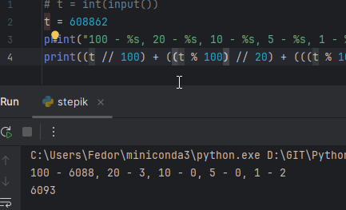

Пример: вычисление следующего за заданным четного числа
```python
# t = int(input())  
t = 96  
print(t + t%2 + 2*((t-1)%2))
```

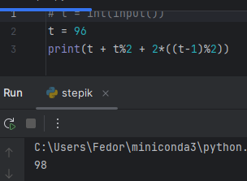

Пример: Вычисления для часов в формате электронных часов. Показано 2 способа вывода
```python
t = 3721  
print(str((t % 86400)//3600), str((t % 86400)%3600//60//10) + str((t % 86400)%3600//60%10), str((t % 86400)%3600%60//10) + str((t % 86400)%3600%60%10), sep = ":")  
print("%s:%s:%s"%(str((t % 86400)//3600), str((t % 86400)%3600//60//10) + str((t % 86400)%3600//60%10), str((t % 86400)%3600%60//10) + str((t % 86400)%3600%60%10)))
```

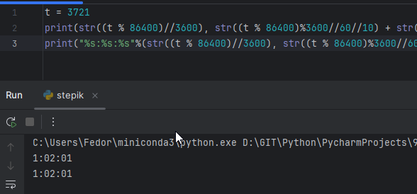