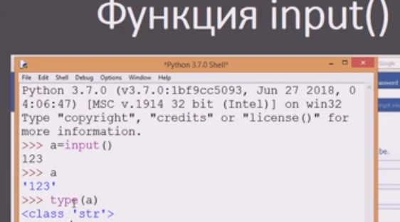
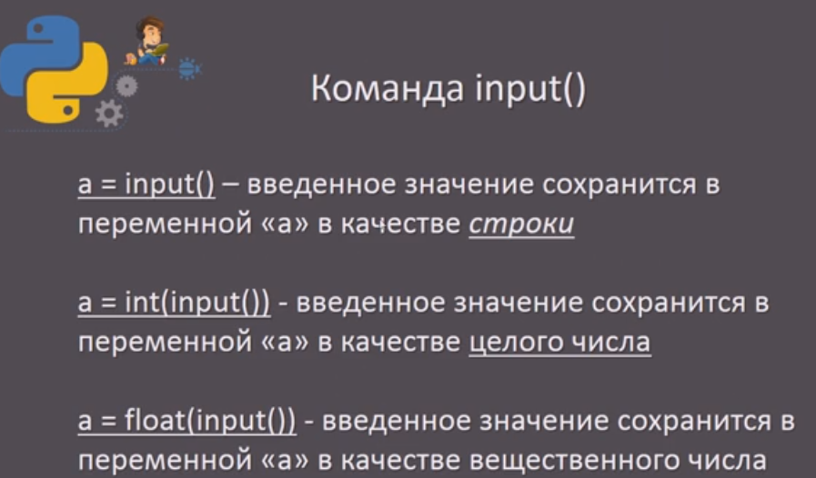
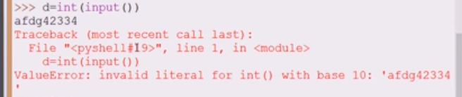
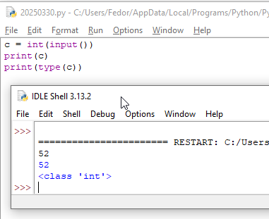
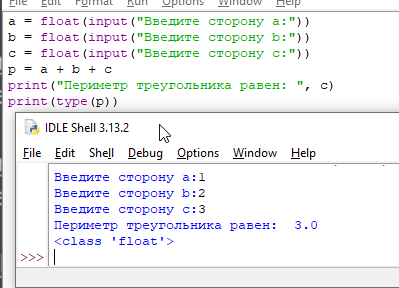

# input()
данные полученные путем считаывания пользовательского ввода имеют тип **str**



# int()
Функция преобразования в целое число
```
c = int(input())
print(c)
print(type(c))
```
Если при вводе будет введено что-то иное, кроме целого значения - будет ошибка



# float()
функция преобразования в вещественное число

# Использование input

## Периметр треугольника

```python
a = float(input("Введите сторону a:"))
b = float(input("Введите сторону b:"))
c = float(input("Введите сторону c:"))
p = a + b + c
print("Периметр треугольника равен: ", p)
print(type(p))
```



## Еще 1 периметр

```python
a, b, c = map(float, input("Введите через пробел стороны треугольника a b c:").split())
# b = float(input("Введите сторону b:"))
# c = float(input("Введите сторону c:"))
print(a, b, c)
p = a + b + c
print("Периметр треугольника равен: ", p)
print(type(p))
```


Задачи на сайте Acmp.ry