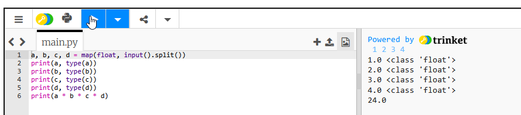

# Ввод нескольких чисел за раз
Для организации считывания чисел через пробел, одной строкой, потребуется следующая инструкция:

 ```python
map(int, input().split())
```

# Пример с int
```python
a, b, c = map(float, input("Введите через пробел стороны треугольника a b c:").split())
# b = float(input("Введите сторону b:"))
# c = float(input("Введите сторону c:"))
print(a, b, c)
p = a + b + c
print("Периметр треугольника равен: ", p)
print(type(p))
```


```python
a, b, c, d, e = map(int, input().split())  
  
print(a, type(a))  
print(b, type(b))  
print(c, type(c))  
print(d, type(d))  
print(e, type(e))  
  
print(max(a, b, c, d, e))
```

# Пример с float


# Пример с str


# pythontutor.com

позволяет заглянуть внутрь кода


`[pythontutor.com](https://pythontutor.com/)` не единственный онлайн-сервис, который предлагает возможность пошагового анализа кода. Вот еще несколько аналогов, которые вы можете попробовать:

     1️⃣ 

     2️⃣ 

     
