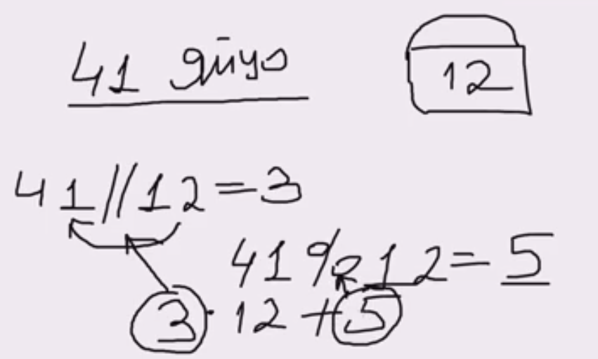
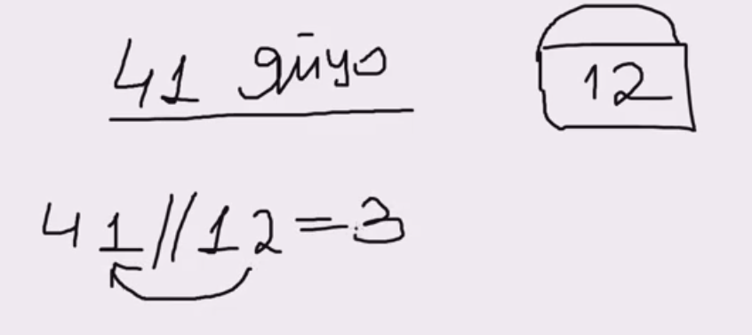
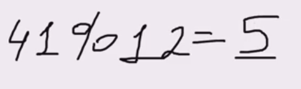

# деление нацело 
деление нацело в питоне - ``` // ``` дает результат деления до запятой



# деление по остатку 


деление по остатку можно использовать при анализе арифметических рядов:
- 8, 15, 22, 29... - дают при %7 = 1
- 10, 17, 24, 31... - дают при %7 = 1