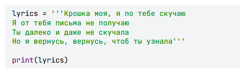
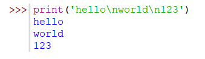
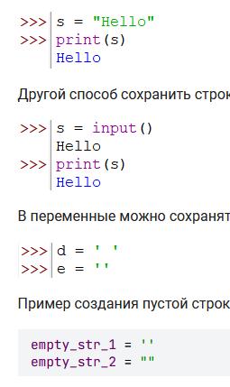
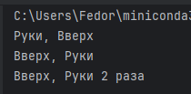
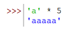
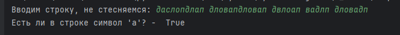
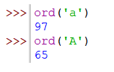
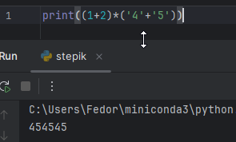

# Как создать строку
- одинарный апостроф 
- двойные кавычки
- тройной одинарный апостроф или кавычки - для многострочных строк

## Перенос строк
Непечатных символов много, **/n** - один из них.


## Сохранение строки в переменную



# Конкатенация
объединение строк в 1. Слеплять можно только строки. Если надо числа, то их надо приводить к строкам
```python
word1 = 'Руки'
word2 = 'Вверх'
num = 2
print(word1 + ', ' + word2)
print(word2 + ', ' + word1)
print(word2 + ', ' + word1 + ' ' + str(num) + ' раза' )
```


## Перевод символа в строку
Если надо числа, то их надо приводить к строкам, см. выше
# Повторение строки
Это дублирование. Если умножить на 0 или отрицательное число, результатом будет пустая строка. Также нельзя умножать на float

# Длина строки
```python
print(len('Ha-ha'))
print(len(' '))
print(len(''))
print(len('!@#$&(@*'))
print(len('Вот это поворот!'))
```
# Поиск символа/подстроки в строке
Проверка вхождения - базовая операция, которая позволяет проверить, есть ли какой-либо символ в нашей строке. Также можно проверить наличие подстроки (ряд символов, стоящих рядом). - результат **True/False**
```python
s = input("Вводим строку, не стесняемся: ")  
print("Есть ли в строке символ 'a'? - ", "а" in s)
```

# Сравнение строк
Строки будут равны, если их длина и символы полностью будут совпадать. Регистр букв при данной операции также важен

## функция ord
Но если сказать более правильно, то сравниваются коды этих символов. Числовое значение каждого символа вы можете получить с помощью функции`ord()`.


# 1  выводит фразу «Я стану крутым программистом!» три раза
Напишите программу, которая выводит фразу «Я стану крутым программистом!» три раза на отдельных строках; строки должны быть именно такие, символ в символ.

Для удобства советую поместить эту фразу в переменную и затем использовать ее при выводе.
```Python
a = "Я стану крутым программистом"  
print((a + "\n")*3)
```

# 2 Программа должна вывести эту букву, повторённую n раз подряд
Напишите программу, которая получает на вход одну букву и целое число `n`.
Программа должна вывести эту букву, повторённую n раз подряд.

**Входные данные:**
Программе на вход подается два значения в разных строках:
- один символ — буква (латинская или кириллическая).
- целое число n (1 ≤ n ≤ 1000) — количество повторений.

**Выходные данные:**
- Строка, содержащая входную букву, повторённую n раз без пробелов.

```Python
symb = input()
n = int(input())
print(symb*n)
```

# 3 выводит «Лев Николаевич Толстой написал "Война и мир"»
Напишите программу, которая выводит «Лев Николаевич Толстой написал "Война и мир"» (без внешних кавычек). 
```Python
str = '''Лев Николаевич Толстой написал "Война и мир"'''  
print(str)
```

# 4 сначала считывает две фразы по очереди и воспроизводит их в той же последовательности
Напишите программу, которая сначала считывает две фразы по очереди, а потом воспроизводит их в той же последовательности, каждую на отдельной строчке.
```Python
str1 = input()
str2 = input()
print(str1)
print(str2)
```

# 5 считывает три фразы по очереди, а потом воспроизводит их в обратной последовательности
Напишите программу, которая сначала считывает три фразы по очереди, а потом воспроизводит их в обратной последовательности, каждую на отдельной строчке.
```Python
str1 = input()
str2 = input()
str3 = input()
print(str3, str2, str1, sep = "\n")
```

# 6 считывает с клавиатуры слово (или фразу, неважно), после чего выводит это же слово четыре раза на одной строке
Напишите программу, которая считывает с клавиатуры слово (или фразу, неважно), после чего выводит это же слово четыре раза на одной строке, разделяя их пробелами.
```Python
S_inp = input()
print((S_inp + " ")*4)
```

# 7 принимает на вход фразу и выводит количество символов в ней
Напишите программу, которая принимает на вход фразу и выводит количество символов в ней. _Подсчёт должен включать все символы, включая пробелы, знаки препинания, цифры и специальные символы._
**Входные данные**
- **Одна строка** — фраза (может содержать буквы, цифры, пробелы, знаки препинания и другие символы).
**Выходные данные**
- **Одно целое число** — количество символов во входной строке.

```Python
S_inp = input()
print(len(S_inp))
```

# 8 принимает на вход две строки и объединяет их в одну с помощью конкатенации
Напишите программу, которая принимает на вход две строки и объединяет их в одну с помощью конкатенации.
**Важно:**
- Первая строка должна **быть добавлена** в конец второй.
- **Дополнительных пробелов между строками быть не должно** (они должны объединяться "как есть").

**Входные данные:**
- Две строки, каждая вводится с новой строки.

**Выходные данные:**
- **Одна строка**, в которой вторая введённая строка **сцеплена** с первой **без пробелов**.

```Python
S_str1 = input()
S_str2 = input()
print(S_str2+S_str1)
```

# 9 Какой результат данной операции (1+2)*('4'+'5') ?
Какой результат данной операции (1+2)*('4'+'5') ?

Надо четко помнить, что подстрока символов умножается на число  и наоборот. Подстрока тут '4'+'5' = '45'




# 10 принимает на вход слово или фразу и увеличивает её длину в 3 раза, повторяя строку трижды подряд
Напишите программу, которая принимает на вход слово или фразу и увеличивает её длину в 3 раза, повторяя строку трижды подряд.
Дополнительных пробелов между повторениями быть не должно.

```Python
S_str = input()
print(S_str*3)
```

# 12 принимает **три символа, разделённых пробелами**, и выводит **их числовые коды** с помощью функции `ord()`
Напишите программу, которая принимает **три символа, разделённых пробелами**, и выводит **их числовые коды** с помощью функции `ord()`, используя следующий формат: 

```php-template
Код символа <символ> равен <код>
```

Где:
- `<символ>` — введённый символ;       
- `<код>` — его числовое представление (полученное с помощью `ord()`);

**Входные данные**
- Одна строка, содержащая три символа, разделённых пробелами.

**Выходные данные**
- **Три строки**, в описанном выше формате:, каждая на отдельной строке.

```Python
S_s1,S_s2,S_s3 = map(str, input().split())
print("Код символа %s равен"%(S_s1),str(ord(S_s1)))
print("Код символа %s равен"%(S_s2),str(ord(S_s2)))
print("Код символа %s равен"%(S_s3),str(ord(S_s3)))
```