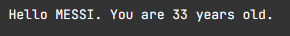

# f-строка
С версии 3,6 Python

```python
name = 'Семён'
mid_name = 'Семёнов'
balance = 32.56

text = f"""Дорогой {name} {mid_name}, 
баланс Вашего лицевого счёта составляет {balance} руб."""

print(text)
```

# Вставка выражений в f-строки
строка формируется сразу с учетом переменной
```python
balance = 32.56
text = f"Баланс после списания: {-balance * 2} руб."
print(text)
```

Внутри фигурных скобок можно вызывать методы и выполнять действия
```python
name = 'Семён'
mid_name = 'Семёнов'
balance = 32.56

text = f"""Дорогой {name.lower()} {mid_name.upper()},
баланс Вашего лицевого счёта составляет {abs(-balance * 2)} руб."""

print(text)
```

А можно сразу печатать строку без сохранения

```python
name = "Иннокентий"
age = 25
print(f"Имя: {name}, Возраст: {age}")
```

Если необходимо вывести еще и имя переменной, то с 3,8 можно писать так, пробелы будут учтены:

```python
x = 14
y = 17
print(f"x = {x}, y = {y}") # x = 14, y = 17
```

# Кавычки
Есть какая-то запутка, поэтому просто запоминаем: работает с 3,10

```python
name = "Анна"  
print(f'Он сказал: {'Привет, ' + name}!') # Он сказал: Привет, Анна!

или 
name = "Анна"  
print(f'Он сказал: \"{'Привет, '+ name}\"!') # Он сказал: "Привет, Анна"!
```


# Вложенные f-**строки**

Совсем не понятно зачем это нужно
```python
name = "Алексей"
age = 25
city = "Краснодар"

print(f"Привет, {name}, {f'{age} лет, {city}'}!") # Привет, Алексей, 25 лет, Краснодар!
```


# 1 необходимо при помощи `f-строки` вывести сообщение:

```python
name = input()
print(f'Мое имя {name}!')
```

# 2 программа должна вывести сообщение:

```python
name = input()  
age = int(input())  
print(f'Hello {name.upper()}. You are {age} years old')
```



# 3 Программа вычисляет когда будет 77 лет с года рождения

```python
name = input()  
born = int(input())  
print(f'{name}, вам исполнится 77 лет в {int(born)+77}')
```

# 4 перевод натурального значения секунд в значение минут определенного формата (см. тестовые данные)

```python
sec = int(input())  
print(f'{sec} сек - это {int(sec//60)} мин. {int(sec%60)} сек.')
```

# 5 Выведите информацию о разрешении экрана и общее количество пикселей

Вам поступает на вход два натуральных числа - ширина экрана и его высота в пикселях. Выведите информацию о разрешении экрана и общее количество пикселей в определенном формате (см. выходные данные в тестах).

Все знаки препинания, пробелы, регистр букв важны. Также обратите внимание, что в этом месте «1920 x 1080» стоит английская буква «x»

```python
wide, height = map(int, input().split())  
print(f'Разрешение экрана: {wide} x {height}.')  
print(f'Общее количество пикселей = {wide * height}.')

```

# 6 Необходимо вывести результат трех видов деления
Давайте при помощи F-строк выведем информацию о трех видах деления, которые мы с вами изучили ранее: обычное деление, целочисленное и деление по остатку. 
**Входные данные**
На вход программе поступают два целых числа, при этом гарантируется, что второе число не равно 0.

**Выходные данные**
Необходимо вывести результат трех видов деления первого числа на второе в определенном формате (см. примеры ниже).

```python
chisl = int(input())  
znamen = int(input())  
print(f'{chisl} / {znamen} = {chisl/znamen}')  
print(f'{chisl} // {znamen} = {chisl//znamen}')  
print(f'{chisl} % {znamen} = {chisl%znamen}')

```

# 7 необходимо найти координаты вектора **`B`**

Нашей программе поступает на вход `x`, `y`, `z` - три целых числа, обозначающих координаты вектора **`А`**. Затем необходимо найти координаты вектора **`B`**, путем увеличения на 5 каждой из координат вектора **`А`**.

Оба вектора необходимо распечатать в определенном формате.

```python
xA = int(input())  
yA = int(input())  
zA = int(input())  
print(f'Vector A({xA}, {yA}, {zA})')  
print(f'Vector B({xA+5}, {yA+5}, {zA+5})')
```

# 8 вывести следующее сообщение
Программа запрашивает у пользователя курс доллара - вещественное число,  и также количество долларов (целое число), которое пользователь хочет приобрести. В итоге программа должна вывести следующее сообщение:

```php-template
Current dollar rate is <курс доллара>. You want to buy <количество долларов> dollars
You must pay <стоимость>
```

```python
curr = float(input())  
n = int(input())  
print(f'Current dollar rate is {curr}. You want to buy {n} dollars')  
print(f'You must pay {n * curr}')
```

# 9

```python

```