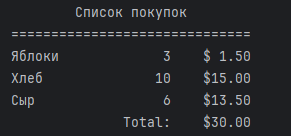
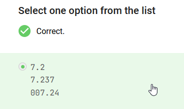

# Форматирование
Python  добавляет пробелы - сам, если число короче заданной ширины:
- слева - **для чисел**
- справа - **для строк**

```python
n = 1234
s = "Alex"
print(f"|{n:7}|")  # выделено 7 символов, |   1234|
print(f"|{s:7}|")  # выделено 7 символов, |Alex   |

print(f"|{n:5}|")  # выделено 5 символов, | 1234|
print(f"|{n:4}|")  # выделено 4 символа,  |1234|
print(f"|{n:2}|")  # выделено 2 символа,  |1234|
...

print(f"|{s:5}|")  # выделено 5 символов, |Alex |
print(f"|{s:4}|")  # выделено 4 символа,  |Alex|
print(f"|{s:2}|")  # выделено 2 символа,  |Alex|
```

# Направление форматирования

На выравнивание символов влево или вправо - можно повлиять

| Символ | Значение                                                                                       |
| ------ | ---------------------------------------------------------------------------------------------- |
| <      | Выравнивает выражение в фигурных скобках по левому краю. У строк такое поведение по умолчанию  |
| >      | Выравнивает выражение в фигурных скобках по правому краю. У чисел такое поведение по умолчанию |
| ^      | Выравнивает выражение в фигурных скобках по центру                                             |
```python

number = 12345.6789
text = "Python 3.12"

print(f"Число {number = }")   # Число number = 12345.6789
print(f"Строка {text = }")    #Строка text = 'Python 3.12'

print(f"|{number:25}|")       #|               12345.6789|
print(f"|{text:25}|")         #|Python 3.12              |

print(f"|{number:<25}|")      #|12345.6789               |
print(f"|{text:<25}|")        #|Python 3.12              |

print(f"|{number:>25}|")      #|               12345.6789|
print(f"|{text:>25}|")        #|              Python 3.12|

print(f"|{number:^25}|")      #|       12345.6789        |
print(f"|{text:^25}|")        #|       Python 3.12       |
```

# Что может быть вместо пробела?
Можно указывать заполнители, но обязательно с символом направления выравнивания, иначе - ошибка, если символ выравнивания - не нуль
```python
number = 12345.6789
print(f"Число {number = }")  #Число number = 12345.6789
print(f"|{number:?<25}|")    #|12345.6789???????????????|
print(f"|{number:!>25}|")    #|!!!!!!!!!!!!!!!12345.6789|
print(f"|{number:-^25}|")    #|-------12345.6789--------|

# ошибка
print(f"|{number:?25}|") # ValueError: Invalid format specifier
# исключение
number = 12345.6789
print(f"|{number:015}|")  # |0000012345.6789|
text = 'AC/DC'
print(f"|{text:^015}|")  # |00000AC/DC00000|

```

# Плейсхолдеры в f-строках

    ➖ в `f-строках` перед буквой типа (`s`, `d`, `f`) не ставится `%`;
    ➖ можно совмещать выравнивание, ширину поля и знаки-разделители.


```python
apple = 'Яблоки'
num = 102
price = 10.4643

print(f'|{apple:20s}|')           
# 20 символов для строки -|Яблоки              |
print(f'Количество: |{num:5d}|')  
# 5 символов  для числа -Количество: |  102|
print(f'Цена: $|{price:>10.2f}|') 
# Выравнивание вправо, 2 знака после запятой -Цена: $|     10.46|
```

## Формат вывода целых чисел
Не применять к строкам, будет ошибка

```python
number = 12345
print(f"Число = {number}") # Число = 12345
print(f"|{number:10d}|")   # |     12345|
print(f"|{number:010d}|")  # |0000012345|
print(f"|{number:?<10d}|") # Выравнивание влево,  |12345?????|
print(f"|{number:!>10d}|") # Выравнивание вправо, |!!!!!12345| 
print(f"|{number:-^10d}|") # Выравнивание по центру, |--12345---|
```

### Разделители разрядов в числах (`d`)
Группируем по 3 разряда
**Можно использовать в качестве разделителя только символы `,` или `_`.**

Для того, чтобы задать разделитель группы, достаточно перед `d` указать значение символа, который будет отвечать за разделитель:

```python
n = 12345678912345

print(f'{n:,d}')  # Разделение запятой
print(f'{n:_d}')  # Разделение нижним подчёркиванием
```

Вот какой вывод будет у программы:

```python
12,345,678,912,345
12_345_678_912_345
```

Можно комбинировать
```python
n = 1234567

print(f'{n:!^15,d}')   #!!!1,234,567!!!
print(f'{n:?>15_d}')   #??????1_234_567
```


## Формат вывода вещественных чисел
**внимание на букву f, стоящую в конце фигурных скобок**
   ✔️ общую ширину числа (количество знаков, которое оно займёт);  
   ✔️ количество знаков после запятой;  
   ✔️ выравнивание;  
   ✔️ заполнение лишних мест нулями или символами.

```python
number = 123.45
print(f"Число = {number}")  # Число = 123.45
print(f"|{number:15f}|")    # |     123.450000|
print(f"|{number:015f}|")   # |00000123.450000|
print(f"|{number:?<15f}|")  # |123.450000?????| 
print(f"|{number:!>15f}|")  # |!!!!!123.450000|
print(f"|{number:-^15f}|")  # |--123.450000---|
```

### Округление и настройка количества знаков после запятой

**{значение:.Nf}** - N - количество знаков после запятой
Python округляет и добавляет недостающие нули.

```python
a = 1 / 8
b = 1 / 2
c = 1 / 3

print(f'{a:.3f}')   # 0.125
print(f'{a:.5f}')   # 0.12500
print(f'{b:.3f}')   # 0.500
print(f'{c:.3f}')   # 0.333
print(f'{c:.6f}')   # 0.333333
print(f'{c:.10f}')  # 0.3333333333
```

```python
num = 12.345
print(f'|{num:7.3f}|')  # 7 символов, 3 после запятой   | 12.345|
print(f'|{num:10.4f}|') # 10 символов, 4 после запятой  |   12.3450|
print(f'|{num:12.2f}|') # 12 символов, 2 после запятой  |       12.35|
```

другие символы и менять выравнивание:

```python
num = 7.25
print(f'|{num:0>10.1f}|')  # |00000007.2|
print(f'|{num:_<10.3f}|')  # |7.250_____|
print(f'|{num:*^10.2f}|')  # |***7.25***|
```

## Отображение целых чисел как вещественных
число целое, можно **вывести его с десятичной частью**.
```python
d = 100
print(f'{d:.1f}')  # 100.0
print(f'{d:.2f}')  # 100.00
print(f'{d:.3f}')  # 100.000
```

## Практический пример


```python
APPLES = .50
BREAD = 1.50
CHEESE = 2.25
num_apples = 3
num_bread = 10
num_cheese = 6
price_apples = num_apples * APPLES
price_bread = num_bread * BREAD
price_cheese = num_cheese * CHEESE
str_apples = 'Яблоки'
str_bread = 'Хлеб'
str_cheese = 'Сыр'
total = price_bread + price_cheese + price_apples
print(f'{"Список покупок":^30s}')
print(f'{"=" * 30}')
print(f'{str_apples:10s}{num_apples:10d}\t${price_apples:>5.2f}')
print(f'{str_bread:10s}{num_bread:10d}\t${price_bread:>5.2f}')
print(f'{str_cheese:10s}{num_cheese:10d}\t${price_cheese:>5.2f}')
print(f'{"Total:":>20s}\t${total:>5.2f}')
```




Что увидим на экране после запуска следующего кода?

```python
val = 7.2365
print(f"{val:.1f}")
print(f"{val:.3f}")
print(f"{val:0>6.2f}")
```



# 1 вывести строку
На вход вашей программе поступают координаты точки `x` и `y` - два целых числа, каждое вводится на отдельной строчке. 

Ваша задача обязательно сохранить поступающие на вход значения в переменные `x` и `y` соответственно, и затем вывести строку вида `Точка(x = {значение}, y = {значение})`

```python
x = int(input())  
y = int(input())  
print(f"Точка(x = {x}, y = {y})")

```

# 2 только шесть знаков после запятой у переменной `number_pi`

```python
number_pi = 3.141592653589793
print(f'{number_pi:.6f}')
```

# 3 принять вещественное число, и вывести его в формате двух знаков после запятой


```python
c = float(input())
print(f'{c:.2f}')

```

# 4 вывести его на экран, отведя как минимум 10 разрядов под отображение числа

Если в числе не хватает разрядов, необходимо выводить незначащие нули

```python
c = int(input())  
print(f'{c:010d}')
```

# 5 выравнивание его по центру, отведя 15 символов

```python
c = int(input())  
print(f'{c:-^15d}')
```

# 6 подправить код ниже так, чтобы он выравнивал

Вам необходимо подправить код ниже так, чтобы он выравнивал

1. первый `print` по центру
2. второй `print` по правому краю
3. третий `print` по левому краю

Количество знаков для выравнивания 20 символов, знак разделителя - `&`
```python
text = input()
print(f"|{text:&^20}|")
print(f"|{text:&>20}|")
print(f"|{text:&<20}|")
```


```python

```