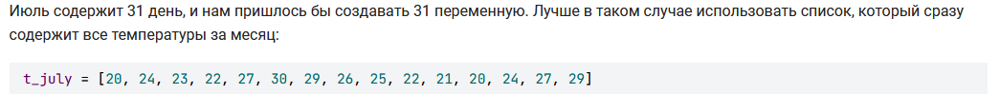
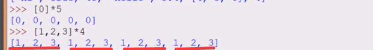
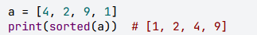
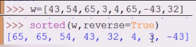
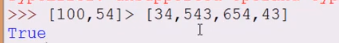

# Что такое списки
Списки - упорядоченные колекции элементов, каждый элемент имеет свое место
- нумерация с 0, если нужны элементы слева
- нумерация с -1, если нужны элементы справа
Элементы списка могут быть разных типов
- type - **list**


- Пустой список создается при помощи **[]**


- Значения элементов списка разделяются через **,**


- Допускается хранить в списке разнородные элементы и даже вложенные списки


- Допускается хранить в списке вложенные списки


# Возможные способы применения

- список товаров в магазине

- Очередь to-do list

- оценки по разным предметам

- показатели за какое-то время

- список покупок

# Инициализация списка
Простой пример инициализации - ввод данных одной строкой. Пробелом может быть любой символ, по-умолчанию - разделитель


Инициализировать список целых чисел путем считывания строки, разделитель - пробел
```
list(map(int, input().split()))
```
Инициализировать список вещественных чисел путем считывания строки, разделитель - пробел
```
list(map(float, input().split()))
```
Инициализировать список целых чисел путем считывания строки, разделитель - запятая
```
list(map(int, input().split(',')))
```
# Операции над списками
## len()
Длина списка, вложенный список будет считаться как 1 элемент


выполнить вычисление длины списка list
```
len(list)
```
## Сцепление/конкатенация
Нельзя прибавлять к списку число


- вывести на экран результат сложения 2 списков


```
print(a+b)
```


- прибавить к концу списка элемент списка


- к началу списка элемент списка

## Тиражирование/дублирование
- умножать можно только на целые числа, это приведет к тому что список будет содержать кратное количество значений


- частный случай - обнуление списка

## in - Поиск по списку
ищется целый элемент в списке, не его часть


вывести результат поиска подстроки **sub** в списке **b**
```
print("sub" in b)
```

## max(list)
поиск максимального значения по списку с числами


вывести максимальное значение в списке **а**
```
print(max(a))
```


## min(list)
поиск минимального значения по списку с числами

вывести минимальное значение в списке **а**
```
print(min(a))
```

## sum(list)
сумма всех значений списка с числами

вывести сумму значений в списке чисел **а**
```
print(sum(a))
```

## sorted(list)
Вывод чисел из списка по возрастанию

вывод списка **а** - в порядке возрастания
```
print(sorted(a))
```

## sorted(list, reversed = True)
Вывод чисел из списка по убыванию

вывод списка **а** - в порядке убывания
```
print(sorted(a, reverse=True))
```

## Сравнение списков
- сравнивать списки разных типов можно только на предмет равенства

- равенство списков возможно, если количество и значение элементов - равны

- Если первый элемент списка больше, то этот список - больше


# Пример  - получение среднего арифметического


Вывести среднее арифметическое списка **а**


# 1 вывести `True` в случае, если в данном списке встречается значение `777`

```python
s = list(map(int, input().split()))
print(777 in a)
```

# 2 найти сумму списка

```python
s = list(map(int, input().split()))
print(sum(s))
```

# 3 вывести два числа через пробел: массу арбуза, который Иван Васильевич купит теще и массу арбуза, который он купит себе.

```python
s = list(map(int, input().split()))
print(f'{min(s)} {max(s)}')
```

# 4 найти среднее арифметическое введенного списка чисел

```python
s = list(map(int, input().split()))
print(sum(s)/len(s))
```
# X

```python

```