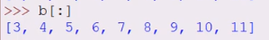

# Списки
Списки - упорядоченные колекции элементов, каждый элемент имеет свое место
- нумерация с 0, если нужны элементы слева
- нумерация с -1, если нужны элементы справа


# Индексы
см. раздел 2.3
```python
список[start:stop]
```
 ➖ `start` - это индекс позиции (включительно), начиная с которой нужно брать срез;
 ➖ `stop` - это индекс позиции (не включительно), на которой необходимо закончить взятие среза.
 
Можно обращаться не ко всему списку, а к нескольким последовательным элементам его, при этом последний указанный индекс выборки - не участвует


- задание диапазона "от N до минус 1 от конца" (последний указанный индекс не задействуется)


- задание диапазона "до последнего"


- задание диапазона "с первого до N" (N не будет учтен)


- диапазон "весь список"


В элемент списка можно занести новое значение (строки не могут этого делать)


Элемент списка можно удалить


Также можно заново инициировать ряд элементов списка (срез)

## Присвоение элементов одного списка другому
Если в список **b** передать список **a** , то изменение элемента списка **a** будет являться изменением списка **b**, так как в питоне переменные хранят ссылки на объект. Если две переменные ссылаются на один и тот же изменяемый объект, то все изменения, которые вы будете производить через одну переменную, будут влиять на сам объект и, соответственно, также влиять и на вторую переменную.

Чтобы избежать этого - надо список **b** инициализировать значениями из списка **a**

# Срезы
см. раздел 2.3
У списка можно указать шаг, с которым извлекать элементы, то есть при взятии среза допускается использовать еще один дополнительный параметр - шаг. В тексте ниже он обозначен через слово step

```python
​список[start:stop:step]
```

 
- с нуля - каждый второй

- с 1 каждый второй

- в диапазоне с 3-7 каждый 3-й

- вывод списка наоборот, с последнего элемента

- с конца списка каждый 2-й


Если срез переопределить меньшим числом элементов, то элемент который не был задан - пропадет из списка, и число элементов списка - уменьшится.


# 1 вывести второй по счету элемент этого списка.

Программа получает на вход список целых чисел, и ваша задача — вывести второй по счету элемент этого списка.  
Гарантируется, что список будет состоять не менее чем из трех элементов.
```python
a = list(map(int, input().split()))
print(a[1])
```

# 2 вывести элементы, стоящие _по счету_ с третьего места по  пятое включительно.
Программа получает на вход список целых чисел, и ваша задача — вывести элементы, стоящие _по счету_ с третьего места по  пятое включительно.

Гарантируется, что список будет состоять не менее чем из пяти элементов.

```python
a = list(map(int, input().split()))
print(a[2:5])

```
# 3 вывести последние три элемента этого списка через срез
Программа получает на вход список целых чисел, и ваша задача — вывести последние три элемента этого списка через срез.
Гарантируется, что список будет состоять не менее чем из пяти элементов.

```python
a = list(map(int, input().split()))
print(a[-3:])
```

# 4 вывести каждый третий элемент этого списка, начиная со второго по счету значения.
Программа получает на вход список целых чисел, и ваша задача — вывести каждый третий элемент этого списка, начиная со второго по счету значения.
Гарантируется, что список будет состоять не менее чем из семи элементов.

```python
a = list(map(int, input().split()))
print(a[1::3])
```

# 5 вывести этот список  в обратном порядке при помощи срезов.

```python
a = list(map(int, input().split()))
print(a[::-1])
```

# X

```python

```