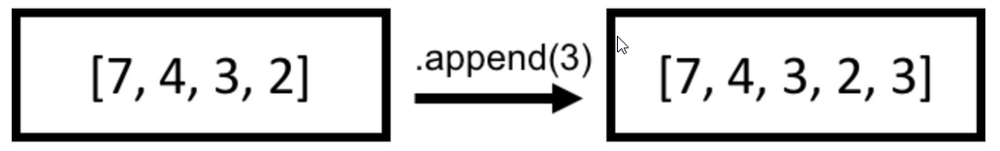
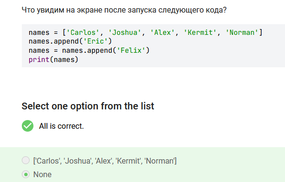
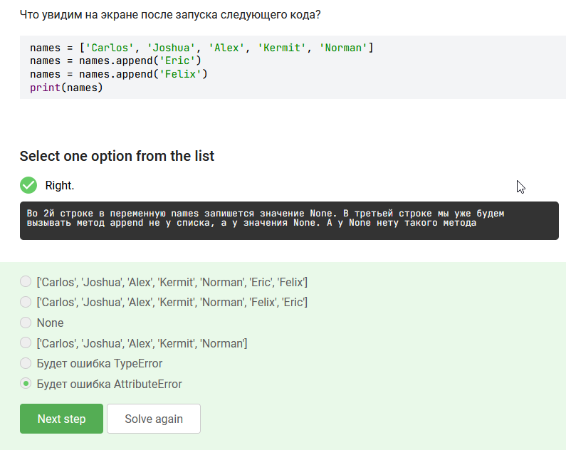
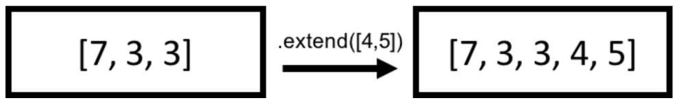
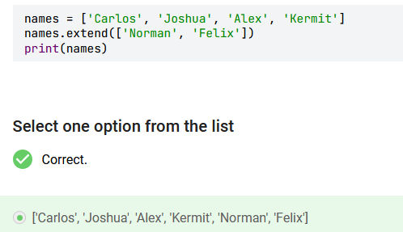
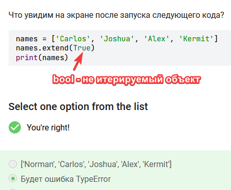
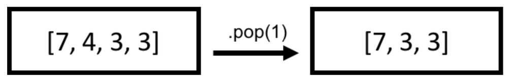
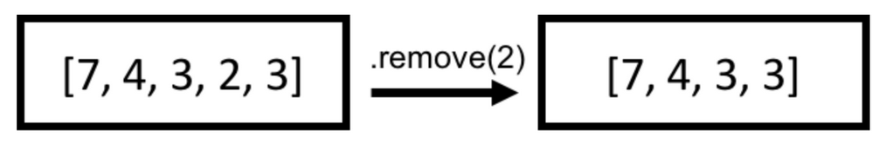
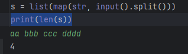
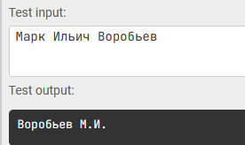

# Что такое метод
Метод - просто функция, которая связана  с определенным типом объекта и применяется к конкретному значению. В отличии от методов строк, методы списка - меняют список. Это называется **Вызвать метод**.

# Добавление элементов
## list.append(x)
Добавляет элемент к концу списка. Ни в коем случае нельзя передавать больше одного значения в один вызов, возникнет ошибка **`TypeError`**:
 - **x** - Элемент, который требуется добавить в список (строка, число, другй список).
 
``` python
lst = []
lst.append(1)
lst  # [1]
lst.append(3)
lst  # [1, 3]

names = ['Carlos', 'Joshua', 'Alex', 'Kermit', 'Norman']  
names.append(['Eric', 'Felix']) # ['Carlos', 'Joshua', 'Alex', 'Kermit', 'Norman', ['Eric', 'Felix']]

```



Если результат добавления записать в сам список, ошибки не будет, но будет результат None




## list.insert(i, 'sub')

Вставляет указанный элемент в указанный индекс, в отличии от append. Вставлять можно только 1 объект.
- **i** - Позиция (индекс), в который требуется поместить элемент. Нумерация ведётся с нуля. Если i больше длины списка, добавляется в конец
- **-i** - вставка предпоследним значением в список. Если i больше длины списка, добавляется в начало
- **x** - Элемент, который требуется поместить в список.

```python
lst = [1, 3]
lst.insert(1, 2)
lst  # [1, 2, 3]
lst.insert(-1, 4)
lst  # [1, 2, 4, 3]
```

При этом алгоритм работы метода
 - увеличиваем размер списка на единицу;
 - смещаем все элементы с заданного индекса вправо
 - записываем новое значение в заданный индекс.
  
## list.extend(iterable)

Дополняет список элементами из указанного объекта.
 - **it** - Объект, элементами которого требуется дополнить список. Итерируемая последовательность состоит из нескольких элементов, поэтому списки и строки являются такой последовательностью.



```python
lst = []
lst.extend([1, 2, 3])  # None
lst  # [1, 2, 3]
lst.extend([100])  # None
lst  # [1, 2, 3, 100]
lst.extend('add')  # None
lst  # [1, 2, 3, 'a', 'd', 'd']
```




# Удаление элементов
## list.clear()
Удаляет из списка все имеющиеся в нём значения.

```python
lst = [1, 2, 3]
lst.clear()  # None
lst  # []
```
Действие метода эквивалентно выражению **del lst[:]**
## list.pop(i)

Возвращает элемент c указанной позиции, удаляя его из списка. Результат вызова `.pop` можно сохранить в переменную и далее использовать это значение.
- **i** - Позиция искомого элемента в списке (целое число). По-умолчания - последний элемент списка. Отрицательные числа поддерживаются.
Если попытаться удалить несуществующий индекс при помощи метода .pop, возникнет исключение  **IndexError: pop index out of range**



```python
lst = [1, 2, 3, 4, 5]
last = lst.pop() # 5
lst # [1, 2, 3, 4]
second = lst.pop(-3) # 2
lst # [1, 3, 4]
first = lst.pop(0) # 1
lst # [3, 4]
```

## list.remove(x)
Удаляет из списка указанный элемент.
- **x** - Элемент, который требуется удалить из списка. Если элемент отсутствует в списке, возбуждается **ValueError**.



Удаляется только первый обнаруженный в списке элемент, значение которого совпадает со значением переданного в метод.

```python
lst = [1, 3]
lst.remove(1)
lst  # [3]  
lst.remove(4)  # ValueError
```

Алгоритм работы метода
- Длина списка уменьшается на единицу,
- Элементы, стоящие справа от удаленного, смещаются влево на одну позицию

Метод `.remove` выбросит ошибку **ValueError**, если значение `x` не будет найдено в списке.

# Другие методы
## list.copy()

Возвращает копию списка. Получим 2 разных списка, меняя значения в одном - в другом они не меняются.
Внимание: Возвращаемая копия является поверхностной (без рекурсивного копирования вложенных элементов), таким образом вложенные списки создаются копированием ссылок, и значения в них уже меняются при изменении одного из списков.
Глубокое копирование выполняется при помощи функции **deepcopy** модуля **copy**
При глубоком копировании происходит не только создание копии основного списка, но и создаются копии всех вложенных объектов.

```python
lst = [1, 2, 3]
lst_copy = lst.copy()  # [1, 2, 3]

a = [34, 23, [12, 28, 9], 15]
b = a.copy()
print(a)  # [34, 23, [12, 28, 9], 15]
print(b)  # [34, 23, [12, 28, 9], 15]

print('-' * 10)

a[0] = 3
a[2][1] = 100
a[2][0] = 77
print(a)  # [3, 23, [77, 100, 9], 15]
print(b)  # [34, 23, [77, 100, 9], 15]
```

Действие метода эквивалентно выражению **lst[:]**.
## list.count('x')
Подсчет количества подстрок заданных в скобках. Числа можно задавать без кавычек

```python
lst = [4, 1, 5, 4, 10, 4]
print(lst.count(4))  # 3
print(lst.count('4')) # 0
```

## list.index('x'[, start[, end]])

Метод возвращает положение первого индекса, со значением х. Также можно указать границы поиска start и end.

```python
lst = [4, 1, 5, 4, 10, 4]
lst.index(4)  # 0
lst.index(4,1,4)  # 3
```


## list.reverse()

Перестраивает элементы списка в обратном порядке.

```python
lst = [1, 'two', 'a', 4]
lst.reverse()  # None
lst  # [4, 'a', 'two', 1]
```

## list.sort(key=None, reverse=False)

Сортирует элементы списка на месте и сохраняет их в этот же список в отсортированном порядке.

- **key=None** - Функция, принимающая аргументом элемент, используемая для получения из этого элемента значения для сравнения его с другими.
- **reverse=False**  - Флаг, указывающий следует ли производить сортировку в обратном порядке. По-умолчанию - **True**

```python
nums = [34, 23, 12, 15]
nums.sort()
print(nums)  # [12, 15, 23, 34]
```

Важно, чтобы список состоял из элементов, которые могут сравниваться между собой. Например, список строк может быть отсортирован, поскольку строки между собой умеют сравниваться

```python
lst = [1, 'two', 'a', 4, 'a']
# Попытка упорядочить/сравнить несравнимые типы вызовет исключение
lst.sort()  # TypeError: unorderable types: str() <= int()
# Отсортируем «вручную», так чтобы 'а' были в конце.
lst.sort(key=lambda val: val == 'a')  # None
# Фактически мы отсортировали в соответствии с маской [False, False, False, True, True]
lst  # ['two', 4, 1, 'a', 'a']
```

# 1. добавить по порядку четыре следующих элемента в конец списка `numbers`: 111, 222, 789 и 201.

В вашем распоряжении список `numbers`, который определяется во входных данных. Ваша задача — добавить по порядку четыре следующих элемента в конец списка `numbers`: 111, 222, 789 и 201.
 В качестве ответа необходимо вывести измененный список `numbers`.
Так как `numbers` определяется внутри входных данных, вам считывать данные не нужно. Сразу пользуйтесь переменной `numbers`.

```python
numbers = [65, 43, 34, 4]
numbers.extend([111, 222, 789, 201])
print(numbers)

```
# 2. выполнить четыре следующих действия в том же порядке, как они указаны в списке

В вашем распоряжении список `numbers`. Ваша задача — выполнить четыре следующих действия в том же порядке, как они указаны в списке:
1. добавить значение `111`  на 5-й индекс;       
2. добавить значение `222`  на 8-й индекс;       
3. добавить значение `789`  на 0-й индекс;       
4. добавить значение `201`  на 11-й индекс;
 В качестве ответа необходимо вывести измененный список `numbers`

```python
numbers = [-214, 181, -139, 448, -20, -917, 32, 422, -895, 198, 284, 472, -986, -964, -989, 29]
numbers.insert(5, 111)
numbers.insert(8, 222)
numbers.insert(0, 789)
numbers.insert(11, 201)
print(numbers)
```

# 3. расширить список `numbers` за счет элементов списка `extra`.

В вашем распоряжении два списка `numbers`  и `extra`, которые определяются во входных данных.
Ваша задача — расширить список `numbers` за счет элементов списка `extra`. Все элементы списка `extra` должны добавиться по порядку в конец списка `numbers`.  В качестве ответа необходимо вывести измененный список `numbers`.
Так как `numbers` и `extra` определяются внутри входных данных, вам считывать данные не нужно. Сразу пользуйтесь переменными `numbers` и `extra`.

```python
numbers = [1, 3, 5, 6, 8]
extra = [2, 4, 7, 9]
numbers.extend(extra)
print(numbers)
```

# 4. выполнить действия из списка строго в том же порядке
В вашем распоряжении список `numbers`. Ваша задача — выполнить действия из списка строго в том же порядке, а именно:
1. удалить элемент, стоящий на последней позиции;
2. удалить элемент, стоящий на 0-й позиции;
3. удалить элемент, стоящий на 12-й позиции;
4. удалить элемент, стоящий на 7-й позиции;

 В качестве ответа необходимо вывести на первой строке измененный список `numbers`, а на второй - сумму значений удаленных элементов

```python
numbers = [-214, 181, -139, 448, -20, -917, 32, 422, -895, 198, 284, 472, -986, -964, -989, 29]
numbers.pop
numbers.pop[0]
numbers.pop[12]
numbers.pop[7]
print(numbers)


```


# 5. Ваша задача удалить из этого списка числа `3`, `5`, `7` и `9`

В вашем распоряжении список `numbers`. ​Ваша задача удалить из этого списка числа `3`, `5`, `7` и `9`. 
 В качестве ответа необходимо вывести измененный список `numbers`

```python
numbers = [-214, 777, 181, 9, 32, -139, 43, 89, 77, 448, -20, -917, 54, 5, 432, 43, 32, 422, -895, 7, 198, 284, 472, 3, -986, -964, -989, 29]
while numbers.count(3)>0:
    numbers.remove(3)
while numbers.count(5)>0:
    numbers.remove(5)
while numbers.count(7)>0:
    numbers.remove(7)
while numbers.count(9)>0:
    numbers.remove(9)
print(numbers)
```
# 6. отсортировать список `numbers` в порядке убывания  и вывести на экран результат

В вашем распоряжении список `numbers`, который определяется во входных данных.
Ваша задача — отсортировать список `numbers` в порядке убывания  и вывести на экран результат. 
Так как `numbers` определяется внутри входных данных, вам считывать данные не нужно. Сразу пользуйтесь переменной `numbers`.

```python
numbers = [9, 5, 32, 64, 3, 4, 6, 3, 7]  
numbers.sort(reverse=True)  
print(numbers)
```

# 7. преобразовать список таким образом, чтобы элементы расположились в обратном порядке

```python
a = list(map(int, input().split()))
a.sort(reverse=True)
print(a)
```
# 8. сколько раз в списке присутствует число 999
Программа получает на вход список из целых чисел. Подсчитайте сколько раз в нем присутствует число 999.
```python
a = list(map(int, input().split()))
print(a.count(999))

```

# 9. скопировать все содержимое списка `numbers` в новую переменную `copy_numbers`

```python
copy_numbers = numbers.copy()
print(copy_numbers)
```
# 10. посчитать, из скольких слов состоит данная фраза

Программа получает на вход фразу, ваша задача — посчитать, из скольких слов состоит данная фраза. Для удобства будем считать словом любую последовательность символов.

```python
s = list(map(str, input().split()))
print(len(s))
```

# 11. Объединить  элементы списка строк `list_strings`  в одну строку, используя тире (`-`) в качестве соединителя

Напишите программу, которая принимает список строк `list_strings` и объединяет его элементы в одну строку, используя тире (`-`) в качестве соединителя.
**Требования:**
- Программа должна использовать метод **`.join()`**;       
- Полученная строка должна содержать элементы списка в исходном порядке, разделённые тире;       
- В конце строки не должно быть лишнего тире.  

**Входные данные**
- Определяется список строк `list_strings`, содержащий от 1 до 10 элементов;       
- Каждая строка состоит из букв, цифр или специальных символов;       
- Вам считывать данные при помощи input не нужно, сразу можете обращаться к переменной `list_strings`.

**Выходные данные**
- Одна строка — элементы списка, соединённые **через `-`**.

```python
list_strings = ['Follow', 'the', 'Cops', 'Back', 'Home']
print('-'.join(list_strings))
```

# 12. преобразовать фразу, чтобы все буквы стали заглавными, и между буквами в каждом слове появились дефисы
Вводится два слова через пробел. Ваша задача — преобразовать данную фразу таким образом, чтобы все буквы стали заглавными, и между буквами в каждом слове появились дефисы.

```python
l = []  
l.extend(input().upper())  
print('-'.join(l).replace('- -', ' '))
```

# 13. вывести фамилию и инициалы
Ваша программа получает на вход строку, содержащую имя, отчество и фамилию человека.  
Вам необходимо вывести фамилию и инициалы.

```python
l = list(map(str, input().split()))
s = l[2] + ' ' + l[0][0:1] + '.' + l[1][0:1] + '.'
print(s)
```



# 14. выводит слова введённой строки (части, разделённые символами пустого пространства) в столбик

```python
l = list(map(str, input().split()))
print('\n'.join(l))
```
