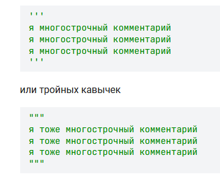
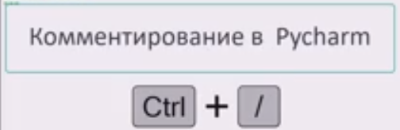

# Комментарий **#**
Комментируем строку или символы в строке после кода. Многострочного кода - так не сделать

# Многострочный каммент
Тут просто используем особенность Python, который считает что между ''' или """ - находится строка с комментариями 

также этими символами можно закомментировать сразу кусок кода

В PyCharm комментарии кода делается через 
