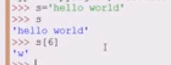

# Индексы
Каждый символ в строке имеет индекс


К символу в строке можно обратиться по индексу, но нельзя обратиться к несуществующему индексу (в данной строке - 11). Индексы начинаются с 0. Таким образом 
- 0 - индекс первого символа всегда.
- -1 - индекс последнего символа (len(s)-1 - индекс последнего символа)


# Срезы
Сразу несколько символов - срез. 

- Печатается срез без последнего указанного символа
- Индекс последнего символа строки - можно не указывать
- Индекс первого символа строки - можно не указывать
- Срез можно задать с указанием символа чередования

- срез можно вывести наоборот: с последнего символа до первого

## шаг среза
```
строка[начало_среза:конец_среза:шаг]
```
- так можно вывести каждый 3-й символ


Изменить букву/символ в существующей строке - нельзя, но строку моно переопределить


# 1 Вывести первый символ данной строки
Программа получает на вход строку, и ваша задача — вывести первый символ данной строки.
```Python
S_str = input()
print(S_str[0])
```

# 2 вывести последний символ этой строки.
Программа получает на вход строку, и ваша задача — вывести последний символ этой строки.
```Python
S_str = input()
print(S_str[-1])
```

# 3 вывести первые 4 символа этой строки
Программа получает на вход строку, и ваша — задача вывести первые 4 символа этой строки.
Гарантируется, что на вход будет поступать строка, длина которой не менее 4 символа.

```Python
S_str = input()
print(S_str[:4])
```

# 4 вывести последние 4 символа этой строки
Программа получает на вход строку, и ваша задача — вывести последние 4 символа этой строки.
Гарантируется, что на вход будет поступать строка, длина которой не менее 4 символа.

```Python
S_str = input()
print(S_str[-4:])
```

# 5 вывести все символы этой строки, которые имеют четные индексы
Программа получает на вход строку. Ваша задача — вывести все символы этой строки, которые имеют четные индексы.

```Python
s = input()
print(s[::2])
```

# 6 вывести все символы этой строки, которые имеют нечетные индексы.
Программа получает на вход строку. Ваша задача — вывести все символы этой строки, которые имеют нечетные индексы.

```Python
s = input()
print(s[1::2])
```

# 7 развернуть строку и вывести ее на экран
Программа получает на вход строку. Ваша задача — развернуть строку и вывести ее на экран.

```Python
s = input()
print(s[::-1])
```

# 8 Выведите каждый третий символ строки в обратном порядке, начиная с последнего
Программа получает на вход строку. Выведите каждый третий символ строки в обратном порядке, начиная с последнего.

```Python
s = input()
print(s[-1::-3])
```

# 9 перенести последнюю букву в начало, тем самым сдвинуть все остальные буквы вправо  
Программа получает на вход одно слово. Ваша задача — перенести последнюю букву в начало, тем самым сдвинуть все остальные буквы вправо на один разряд. В качестве ответа нужно вывести полученное слово.

```Python
s = input()
print(s[-1] + s[1:len(s)-1])

или так:
s = input()
print(s[-1] + s[:-1])
```