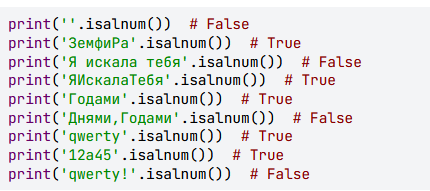

# Что такое метод
Метод - просто функция, которая связана  с определенным типом объекта и применяется к конкретному значению
Любой метод строки не меняет саму строку. То есть метод работает с содержимым строки, не меняя ее. Это называется **Вызвать метод**.


Если мы хотим изменить содержимое строки, мы должны ее переопределить, инициализирова новым значением
Перечисленные ниже методы можно использовать цепочкой перед инициализацией переменной, при вводе текста пользователем
```python
s = input().upper()
print(s)    # 'ЗАГЛАВНЫЕ БУКВЫ'
s = input().upper().replace('А', '!')
print(s)    # 'З!ГЛ!ВНЫЕ БУКВЫ'
```


# Методы, которые меняют буквы в строках
## upper()
Все символы - заглавные, кроме знаков пунктуации, символов и цифр
```python
s = "hello world"
print(s.upper()) # HELLO WORLD
s = s.upper() # HELLO WORLD
```
метод используется при приведении символов строки к верхнему регистру при стравнении
## lower()
```python
s = "HELLO WORLD"
print(s.lower()) # hello world
s = s.lower() # hello world
```


## title()
**s.title()**
каждое слово строки будет с заглавной буквы.
```python
s = 'Год за годом растут БОЛЬШИЕ города!'
print(s.title())   # 'Год За Годом Растут Большие Города!'
```

## capitalize()
**s.capitalize()**
Только первое слово строки будет с заглавной буквы.
```python
s = 'Год за годом растут БОЛЬШИЕ города!'
print(s.capitalize())   # 'Год за годом растут большие города!'
```

## swapcase()
**s.swapcase()**
все заглавные буквы в строчные, а строчные - в большие.
```python
s = 'Год за годом растут БОЛЬШИЕ города!'
print(s.swapcase())   # 'гОД ЗА ГОДОМ РАСТУТ большие ГОРОДА!'
```

# Методы для идентификации элементов в строке
## find()
**s.find(sub[, start[, end]])**
искомая подстрока , откуда начинаем (начало строки в нуле), где заканчиваем искать
Считает где встречается первый раз подстрока целиком. Если не найдено ничего - вернется **-1**
```python
s = 'hello world'
print(s.find('wor')) # 6
print(s.find('z')) # -1
print(s.find('ll'))  # 2
print(s.find('hello'))  # 0
print(s.find('hell '))  # -1
print(s.find('world'))  # 6
```

**​S.find(sub, start])**
```python
s = 'hello world'
print(s.find('o'))  # 4
print(s.find('o', 4))  # 4
print(s.find('o', 5))  # 7
print(s.find('e', 3))  # -1
print(s.find('hello', 1))  # -1
```

**S.find(sub, start, end)**
```python
s = 'hello world'
print(s.find('o'))  # 4
print(s.find('o', 1, 4))  # -1
print(s.find('o', 1, 5))  # 4
print(s.find('w'))  # 6
print(s.find('w', 1, 6))  # -1
print(s.find('w', 1, 7))  # 6
print(s.find('llo'))  # 2
print(s.find('llo', 2, 4))  # -1
print(s.find('llo', 1, 5))  # 2
```

## rfind()
**s.rfind(sub[, start_from_end])**
ищет с конца
```python
s = 'hello world'
print(s.rfind('h'))  # 0
print(s.rfind('o'))  # 7
print(s.rfind('x'))  # -1
print(s.rfind('ll'))  # 2
print(s.rfind('hello'))  # 0
print(s.rfind('hell '))  # -1
print(s.rfind('world'))  # 6
```

с заданным индексом слева начала поиска по нумерации символов строки (слева)
```python
s = 'hello world'
print(s.rfind('o'))  # 7 - перебор во всей строке справа налево. О - 7-й символ (от начала строки)
print(s.rfind('o', 7))  # 7  - перебор справа налево до 7 символа (от начала строки). как раз 7-м символом и будет О
print(s.rfind('o', 8))  # -1 - перебор справа налево до 8 символа (от начала строки). О - не встречается
print(s.rfind('e', 3))  # -1 - перебор справа налево до 3 символа (от начала строки). До 3-го символа слева Е - не встречается
print(s.rfind('e', 1))  # 1 - перебор справа налево до 1 символа (от начала строки). Е - 1 символ от нулевого номера начала строки
print(s.rfind('hello', 1))  # -1 - перебор справа налево до 1 символа (от начала строки). hello встречается с 0 номера начала строки 
```

в котором передаем подстроку и значения `start` и `end` для ограничения поиска

**s.rfind(sub[, start_from_end])**
```python
s = 'hello world'
print(s.rfind('o'))  # 7 - перебор во всей строке справа налево. О - 7-й символ (от начала строки)
print(s.rfind('o', 1, 7))  # 4 - перебор справа налево в диапазоне от 1 до 7 символа (от начала строки), 0 - 4 символ
print(s.rfind('o', 1, 8))  # 7 - перебор справа налево в диапазоне от 1 до 7 символа (от начала строки)
print(s.rfind('o', 1, 4))  # -1 - перебор справа налево в диапазоне от 1 до 4 символа (от начала строки)
print(s.rfind('w'))  # 6
print(s.rfind('w', 1, 6))  # -1 - перебор справа налево в диапазоне от 1 до 6 символа (от начала строки)
print(s.rfind('w', 1, 7))  # 6 - перебор справа налево в диапазоне от 1 до 7 символа (от начала строки)
print(s.rfind('llo'))  # 2 - перебор во всей строке справа налево.
print(s.rfind('llo', 2, 4))  # -1 - перебор справа налево в диапазоне от 2 до 4 символа (от начала строки)
print(s.rfind('llo', 1, 5))  # 2 - перебор справа налево в диапазоне от 1 до 5 символа (от начала строки)
```

## index()
**s.index(sub[, start[, end]])**

Разница с find - в том что index вернет ошибку, если не будет ничего найдено

```python
s = 'hello world'
print(s.index('h'))  # 0
print(s.index('o'))  # 4
print(s.index('ll'))  # 2
print(s.index('hello'))  # 0
print(s.index('world'))  # 6
```

Можно передавать второй и третий аргумент для указания начала и конца поиска

**s.index(sub[, start[, end]])**
```python
s = 'hello world'

print(s.index('o'))  # 7
print(s.index('o', 7))  # 7 - поиск с 7 символа слева
# print(s.index('o', 8))  # ValueError - поиск с 8 символа слева
print(s.index('e', 1))  # 1 - поиск с 1 символа слева
# print(s.index('e', 3))  # ValueError - поиск с 3 символа слева
# print(s.index('hello', 1))  # ValueError - поиск с 1 символа слева
```

**s.index(sub[, start[, end]])**
```python
s = 'hello world'
print(s.index('llo'))  # 2
# print(s.index('e', 3))  # ValueError - поиск с 3 символа слева
# print(s.index('llo', 2, 4))  # ValueError - поиск со 2 по 4 символ слева
```


# Метод replace

## replace()
**s.replace(string, sub)**
замена подстроки(sub) в выводе строки(string)
```python
s = 'hello world'
print(s.replace('o', '???')) # hell??? w???rld - заменили все o на ???
print(s.replace('o', '')) # hell word - убрали все o
print(s.replace(' ', '')) # helloworld - убрали пробел
print(s.replact('l', '', 2)) # heo world - убрали l 2 раза с начала строки
```

# Методы дополнения строки символами

## rjust()
**s.rjust(string[ширина строки[, 'знак_заполнителя']])**
**s.rjust(string[width[, fillchar]])**
добивает по-умолчанию пробелами слева от заданной строки до нужной длины
```python
s = '1234'
print(s.rjust(6)) # '  1234' - вперед добавлено 2 пробела
print(s.rjust(6, '0')) # '001234' - вперед добавлено 2 нуля
```

если ширина строки меньше исходного текста - возвращаем исходный текст
## ljust()
**s.ljust(string[ширина строки[, 'знак_заполнителя']])**
**s.ljust(string[width[, fillchar]])**
добивает по-умолчанию пробелами cправа от заданной строки до нужной длины.
заполнитель - всегда 1 символ. 2 и более - ошибка
```python
s = '1234'
print(s.ljust(6)) # '1234  ' - назад добавлено 2 пробела
print(s.ljust(6, '0')) # '123400' - назад добавлено 2 нуля
```
если ширина строки меньше исходного текста - возвращаем исходный текст
## center()
**s.center(string[ширина строки[, 'знак_заполнителя']])**
**s.center(string[width[, fillchar]])**
добивает по-умолчанию пробелами cправа и слева от заданной строки до нужной длины.
заполнитель - всегда 1 символ. 2 и более - ошибка. В случае если число добавляемых символов нечетное - больше символов окажется слева
```python
s = '1234'
print(s.center(6)) # ' 1234 ' - вперед и назад добавлен 1 пробел
print(s.center(6, '0')) # '012340' - вперед и назад добавлен 1 нуль
```
если ширина строки меньше исходного текста - возвращаем исходный текст
## zfill()
**s.zfill(string[ширина строки])**
**s.zfill(string[width])**
добивает по-умолчанию нулями cправа и слева от заданной строки до нужной длины.
заполнитель - всегда 1 символ. 2 и более - ошибка
```python
s = '1234'
print(s.zfill(6)) # '001234' - вперед добавлено 2 нуля
print('qwerty'.zfill(10)) # '0000qwerty' - вперед добавлены 4 нуля
```
# Методы выполняющие проверку
## islower()
**s.islower()**
Проверяет что строка состоит только из алфавитных букв в нижнем регистре. Возвращает **true/false**, пробелы, цифры, препинания - игнорятся

Пробел даст False

## isupper()
**s.isupper()**
Проверяет что строка состоит только из алфавитных букв в верхнем регистре. Возвращает **true/false**, пробелы, цифры, препинания, дефис - игнорятся


Пробел даст False

## isdigit()
проверяет что все символы в строке -цифры . Пробел - не цифра - вернет **false**
```python
s = '1234 5675'
print(s.isdigit()) # False - есть пробел

text = 34567 
print(text.isdigit()) # False - AttributeError: 'int' object has no attribute 'isdigit'
```

Удобно использовать при проверке что строка только из цифр и является числом.


## isalpha()
проверяет что все символы в строке - буквы. пробел не буква - вернет **false**
```python
s = 'hello world'
print(s.isalpha()) # False - есть пробел
```


## isalnum()
проверяет что все символы в строке - буквы и цифры. пробел не буква - вернет **false**
```python
s = 'helloworld123'
print(s.isalnum()) # True
```


## istitle()
проверяет что все слова в строке начинаются с большой буквы. Пробел, пунктуация - ингорируются.
```python
s = 'Земфира'
print(s.istitle()) # True
```


# Методы удаления лишних символов
## strip()
**s.strip([chars])**
удаляет знаки пробелов и переносов на новую строку как слева, так и справа

```python
s = '     65.25.45.65   /n'
print(s.strip())            # '65.25.45.65'
print(s.lstrip())           # '65.25.45.65   /n'
print(s.rstrip())           # '     65.25.45.65'
```

можно задавать символы, которые удаляются, при этом удаляться будут символы именно из этого набора, вне зависимости от их следования
**s.strip([chars])**

```python
s3 = "###Python###"
print(s3.strip("#"))

s4 = "abcbcaTacoabcbca"
print(s4.strip("abc"))

print('321232321_USB_31121312'.strip('123')) # _USB_

s = "ritritAlgorithmtirtir"
print(s.strip("tir"))  # Algorithm
```

## rstrip()
**s.rstrip([chars])**
Удаление знаки пробелов и переносов на новую строку справа.
Аналогично удалены могут заданные шаблоном символы

```python
s = "  Hello, world!  "
print(s.rstrip())  # '  Hello, world!'

s2 = '\n  \n\n_USB_\n  \n\n  \n'
print(s2.rstrip())  # '\n  \n\n_USB_'

s3 = "###Python###"
print(s3.rstrip("#"))  # '###Python'

print('\n\n\n_USB_\n\n\n\n'.rstrip())

print('321232321_USB_31121312'.rstrip('123'))
```

## lstrip()
**s.lstrip([chars])**
Удаление знаки пробелов и переносов на новую строку слева.
Аналогично удалены могут заданные шаблоном символы
```python
s = "  Hello, world!  "
print(s.lstrip())  # 'Hello, world!  '

s2 = '\n  \n\n_USB_\n  \n\n  \n'
print(s2.lstrip())  # '_USB_\n  \n\n  \n'

s3 = "###Python###"
print(s3.lstrip("#"))  # 'Python###'

print('\n\n\n_USB_\n\n\n\n'.lstrip())
print('321232321_USB_31121312'.lstrip('123'))
```

# Другие методы
## count()
**s.count(sub[, start[, end]])**
искомая подстрока, откуда начинаем (начало строки в нуле), где заканчиваем искать
подсчет сколько раз встретилась искомая подстрока в строке. В метод надо обязательно передать хоть что-то, вызов метода без подстроки вызовет ошибку.
**s.count(sub[, start[, end]])**
```python
s = "hello world"
print(s.count('o')) # 2 раза
```

При вычислении количества совпадений, имеем в виду что считаются только непересекающиеся подстроки


## split()
**s.split(string, 'разделитель', 'maxsplit')**
Возвращает список. Разбивает строку на подстроки по символу - разделителю (чувствителен к регистру), и каждую подстроку сохраняем отдельным элементом списка. По-умолчанию разделитель - пробел ' '

**s.split(string, 'разделитель')**
```python
s = '1234 2567 28'
print(s.split()) # '['1234', '2567', '28']  ' - Список из 3 элементов
print(s.split('2'))   # ['1', '34 ', '567 ', '8']
print(len(s.split())) # '3' - 3 элемента в первоначальном списке
```

Метод удобно использовать 
- при вычислении количества элементов в строке. 
- при разбиегии строки по "." или ","
- при инициализации списка по любому разделителю или пробелу
```python
s = '12.45.65.25.45.65'
print(s.split('.'))    # ['12', '45', '65', '25', '45', '65']
s = list(map(str, input().split()))
print(s)
```

**s.split(string, 'разделитель', 'maxsplit')**
Можно ограничивать число элементов результирующего списка
```python
fruits = 'Apple#Banana#Cherry#Orange'
# без ограничений
print(fruits.split('#'))       # ['Apple', 'Banana', 'Cherry', 'Orange']
# лимит в одно разбиение
print(fruits.split('#', 1))    # ['Apple', 'Banana#Cherry#Orange']
# лимит в 2 разбиения
print(fruits.split('#', 2))    # ['Apple', 'Banana', 'Cherry#Orange']
# запрет разбиения
print(fruits.split('#', 0))    # ['Apple#Banana#Cherry#Orange']

```

## join()
**'+'.join(s)**
Сливает элементы списка в строку. Все элементы списка должны быть строкового типа. Перед вызовом метода указываем соединитель. Соединитель не печатается перед первым и после последнего элементов. Все данные в списке воспринимаются как строки.

**'+'.join(s)**
```python
s = '12.45.65.25.45.65'
l = s.split('.')            # ['12', '45', '65', '25', '45', '65'] - Список
s1 = '+'.join(l)            # 12+45+65+25+45+65 - строка
s2 = ','.join(s.split('.')) # 12,45,65,25,45,65 - строка
print(s1)            # 12+45+65+25+45+65
print(s2)            # 12,45,65,25,45,65
```


## endswith(), startswith()
**S.endswith(prefix[, start[. end]])**
проверка - заканчивается или начинается ли строка искомой подстрокой. Возвращаемые значения **true/false**
**S.endswith(prefix[, start[. end]])**
- аргумент start - попадает в проверку
- аргумент end - НЕ попадает в проверку


# Задачи
## 1 преобразовать строку так, чтобы все символы были только заглавными
На вход программе поступает строка, состоящая как из заглавных, так и из строчных букв латинского алфавита. Ваша задача — преобразовать строку так, чтобы все символы были только заглавными.,
```python
s = input().upper()
print(s)
```

## 2 преобразовать строку так, чтобы все символы были только строчными
На вход программе поступает строка, состоящая как из заглавных, так и из строчных букв латинского алфавита. Ваша задача — преобразовать строку так, чтобы все символы были только строчными.
```python
s = input().lower()
print(s)
```

## 3 сравнивать две введенные строки на равенство, при этом не учитывая регистр букв
Программиста Тихона попросили написать программу, которая должна была сравнивать две введенные строки на равенство, при этом не учитывая регистр букв. Если строки вводились одинаковые, программа Тихона должна была печатать `True`, в противном случае — `False`.

Но что-то пошло не так. Тихон написал программу, в которой есть ошибки. Ваша задача — исправить имеющуюся программу так, чтобы она прошла все тесты.
```python
s = input()
s1 = input()
print(s.lower() == s1.lower())
```

## 4 отформатировать строку так, чтобы первые 3 и последние 3 символа были заглавными, а оставшиеся — строчными
На вход подается строка. Ваша задача — отформатировать строку так, чтобы первые 3 и последние 3 символа были заглавными, а оставшиеся — строчными.

**Примечание:**  
Количество букв может быть различным, но гарантируется, что их количество не меньше 6.
```python
s = input()  
s1 = s[:3].upper()  
s2 = s[-3:].upper()  
print(s1+s[3:-3].lower()+s2)
```

## 5 преобразовать строку так, чтобы все строчные символы заменились на заглавные, все заглавные - на строчные
На вход программе поступает строка, состоящая как из заглавных, так и из строчных букв. Ваша задача — преобразовать строку так, чтобы все строчные символы заменились на заглавные, все заглавные - на строчные. Символы пунктуации и цифры не нужно преобразовывать.

В качестве ответа нужно вывести полученную строку.
```python
s = input()  
print(s.swapcase())
```

## 6 преобразовать строку так, чтобы первая буква у каждого слова стала маленькой, а остальные буквы превратились в заглавные
На вход программе поступает строка, состоящая как из заглавных, так и из строчных букв. Ваша задача — преобразовать строку так, чтобы первая буква у каждого слова стала маленькой, а остальные буквы превратились в заглавные. Символы пунктуации и цифры не нужно преобразовывать.

В качестве ответа нужно вывести полученную строку.

```python
s = input().lower().title().swapcase()
print(s)
```

## 7 вывести на экран индекс первой найденной латинской буквы `a`
На вход программе поступает строка, ваша задача — вывести на экран индекс первой найденной латинской буквы `a`.

Если такого символа во введенной строке нет, выведите -1

```python
s = input()
print(s.find('a'))
```

## 8 вывести на экран индекс последней найденной латинской буквы `a`
На вход программе поступает строка, ваша задача — вывести на экран индекс последней найденной латинской буквы `a`.

Если такого символа во введенной строке нет, выведите значение -1.

```python
s = input()
print(s,rfind('a'))
```

## 9 заменить все пробелы запятыми и вывести полученную строку
Программа получает на вход фразу, состоящую из нескольких слов, разделенных пробелом.
Ваша задача — заменить все пробелы запятыми и вывести полученную строку.
```python
s = input().replace(' ', ',')
print(s)
```

## 10 удалить из строки все символы `w` и `z`
На вход программе поступает строка, ваша задача — удалить из нее все символы `w` и `z`.
Учитываем только маленькие буквы.
```python
s = input().replace('w', '')
s = s.replace('z', '')
print(s)
```

## 11 в заданной строке из прописных и строчных латинских букв - выполнить часть подзадач
Петя записался в кружок по программированию. На первом занятии Пете задали написать простую программу. Программа должна делать следующее: в заданной строке, которая состоит из прописных и строчных латинских букв, она:

- удаляет все гласные буквы,
- перед каждой согласной буквой ставит символ ".",
- все прописные согласные буквы заменяет на строчные.

Гласными буквами считаются буквы `A`, `O`, `Y`, `E`, `U`, `I`, а согласными — все остальные. На вход программе подается ровно одна строка, она должна вернуть результат в виде одной строки, получившейся после обработки.

```python
s = input().upper()  
s_glasn = s.replace('A', '')  
s_glasn = s_glasn.replace('O', '')  
s_glasn = s_glasn.replace('Y', '')  
s_glasn = s_glasn.replace('E', '')  
s_glasn = s_glasn.replace('U', '')  
s_glasn = s_glasn.replace('I', '')  
s_soglasn = s_glasn.lower()  
l_soglasn = list(s_soglasn)  
j_soglasn = '.'+'.'.join(l_soglasn)  
print(j_soglasn)

# или

a = input().lower()
print('.'+'.'.join(list(a.replace("a","").replace("o","").replace("y","").replace("e","").replace("u","").replace("i",""))))

```