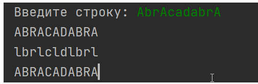
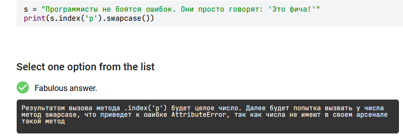

# Цепочка вызовов

Методы можно вызывать друг за другом при печати
```python
spell = 'AbracAdAbra'
print(spell.swapcase().replace('A', 'O'))  # aBROCaDaBRO

spell = 'Abracadabra'
print(spell.replace('a', ',').replace('r', '!').replace('b', '?'))  # A?!,c,d,?!,
```

Также можно поступать с результатом ввода

```python
text = input('Введите строку: ').upper()
print(text)
print(text.lower().replace('a', 'l'))
print(text)
```



Возможны ошибки, если метод строки пытаться применить к другому типу



# 1 подсчитать, сколько раз в ней встречается латинская буква «e»
На вход программе поступает строка, ваша задача — подсчитать, сколько раз в ней встречается латинская буква «e». При этом стоит учитывать при подсчете как маленькие, так и заглавные буквы.

```python
s = input()
print(s.lower().count('e'))
```

# 2 начинается ли введенная фраза строкой `mam` вне зависимости от регистра букв.

Напишите программу, которая проверяет, начинается ли введенная фраза строкой `mam` вне зависимости от регистра букв.

В качестве ответа необходимо вывести **`True`**, если введенная строка начинается с `mam`, во всех остальных случаях нужно вывести **`False`**.

```python
s = input()
print(s.lower().startwith('mam'))
```

# 3 проверяет, заканчивается ли введенная фраза `s` строкой `postfix`
Программа получает на вход две строки, назовем их `s` и `postfix`. Напишите программу, которая проверяет, заканчивается ли введенная фраза `s` строкой `postfix`.
**Входные данные**
В отдельных строках вводятся два значения: сперва строка `s`, затем строка `postfix`.
**Выходные данные**
Нужно вывести `True`, если введенная строка `s` заканчивается строкой `postfix` , во всех остальных случаях нужно вывести `False.` Регистр букв нужно учитывать.

```python
s = input()
postfix = input()
print(s.endswith(postfix))
```

# 4 проверяет, что введенная фраза `s` одновременно начинается со строки `prefix` и заканчивается строкой `postfix`
Напишите программу, которая проверяет, что введенная фраза `s` одновременно начинается со строки `prefix` и заканчивается строкой `postfix`.
**Входные данные**
В отдельных строках вводятся три значения: сперва строка `s`, затем строка `prefix` и потом `postfix`.
**Выходные данные**
Нужно вывести `True`, если введенная строка `s` одновременно начинается со строки `prefix` и заканчивается строкой `postfix` . Во всех остальных случаях нужно вывести `False.` Регистр букв нужно учитывать.
```python
s = input()
prefix = input()
postfix = input()
print(s.startswith(prefix) and s.endswith(postfix))
```

# 5 дополнить введенную строку до 15 символов в том случае, когда ей не хватает длины
На вход программе поступает строка, состоящая из произвольного количества символов. Ваша задача — дополнить введенную строку до 15 символов в том случае, когда ей не хватает длины. Дополнять ее нужно символом **`-`**, ставя его в конец строки. В качестве ответа нужно вывести преобразованную строку.

Если поступала на вход строка, у которой уже имелось как минимум 15 символов, то преобразований выполнять никаких не нужно. Выведите строку в том виде, в котором она вводилась.

```python
s = input()
print(s.ljust(15, '-'))
```

# 6 дополнить ее впереди восклицательными знаками так, чтобы длина строки стала равной 10 символам
На вход программе поступает строка. Ваша задача — дополнить ее впереди восклицательными знаками так, чтобы длина строки стала равной 10 символам.

Если на вход поступила строка, длина которой уже превысила 9 символов, то дополнять ее знаками **`!`** не нужно. Просто выведите строку в том виде, в котором она вводилась.

```python
s = input()
print(s.rjust(10,'!'))
```

# 7 дополните введенную строку до 15 символов
При помощи метода `.center` дополните введенную строку до 15 символов. В качестве параметра `fillchar` возьмите нижнее подчеркивание **`_`**

```python
s = input()
print(s.center(15,'_'))
```

# 8 вывести данное число так, чтобы вывод занимал 10 разрядов
На вход программе поступает натуральное число, которое не превосходит значение 109.

Ваша задача — вывести данное число так, чтобы вывод занимал 10 разрядов. Если у числа не хватает разрядов, необходимо добавить вперед незначащие нули.
```python
i = input()
print(i.rjust(10,'0'))
```

# 9 проверяет состоит ли введенная строка целиком из цифр

Напишите программу, которая проверяет состоит ли введенная строка целиком из цифр

В качестве ответа необходимо вывести `True`, если условие выполняется, во всех остальных случаях нужно вывести `False`
```python
s = input()
print(s.isdigit())
```

# 10  состоит ли введенная строка целиком из строчных букв
Напишите программу, которая проверяет состоит ли введенная строка целиком из строчных букв

В качестве ответа необходимо вывести `True`, если условие выполняется, во всех остальных случаях нужно вывести `False`


```python
s = input()
print(s.islower())
```

# 11 состоит ли введенная строка целиком из заглавных букв
Напишите программу, которая проверяет состоит ли введенная строка целиком из заглавных букв

В качестве ответа необходимо вывести `True`, если условие выполняется, во всех остальных случаях нужно вывести `False`
```python
s = input()
print(s.isupper() and s.isalpha())

```