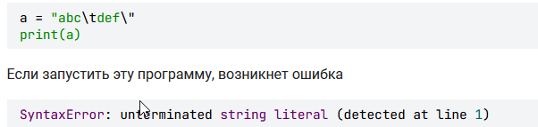
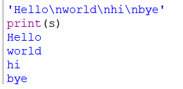
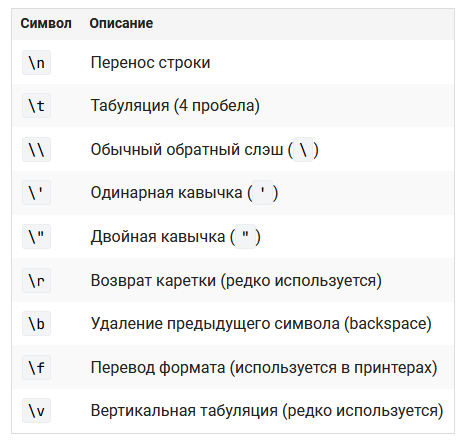
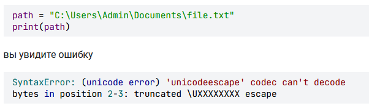
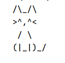
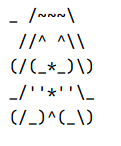

это символы с обратным слэшем **```\```**
длина экранированного символа = 1
```python
a = "abc\ndef"
print(len(a))  # 7 (т.к. \n считается за 1 символ)
```
# repr() - просмотр экранированных символов

```python
s = """Hello
world
!"""
print(repr(s))  # 'Hello\nworld\n!'
```

# Ошибка если строку завершить \



Чтобы ее избежать надо экранировать символ **```\```**, например вот так **```\\```**
# Перенос строки
**```\n```** - перенос строки
В переменную надо заносить строку с этим символом, если хотим чтобы был перенос строк



```python
a = "abc\ndef"
print(a)
```


# Символ табуляции
**```\t```** - эквивалент 4 пробелов. 

```swift
a = "abc\tdef"
print(a)
...
abc     def
```

# Все экранированные символы



# Доступ к файлу в Win



Правильно так

```python
path = "C:\\Users\\Admin\\Documents\\file.txt"

print(path)  # C:\Users\Admin\Documents\file.txt
```

или сырой строкой
# Сырая строка

нужно перед строкой поставить букву **`r`** или **`R`**, например:

```python
path = r"C:\Users\Admin\Documents\file.txt"
print(path)  # C:\Users\Admin\Documents\file.txt
```

# 1 Создайте рисунок котика


Старайтесь для переноса строк использовать экранированный символ "\n".

```python
s = "/\\_/\\\n>^,^< \n / \\  \n(|_|)_/"  
print(s)
```

# 2 Создайте рисунок песика


```python
s = "_ /~~~\\ \n //^ ^\\\\ \n(/(_*_)\\)\n_/''*''\\_\n(/_)^(_\\)"
print(s)

```


```python

```