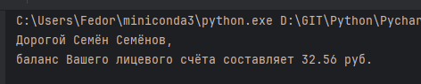
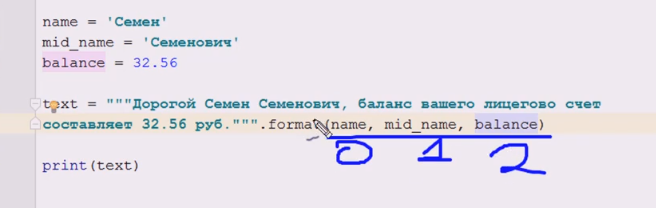
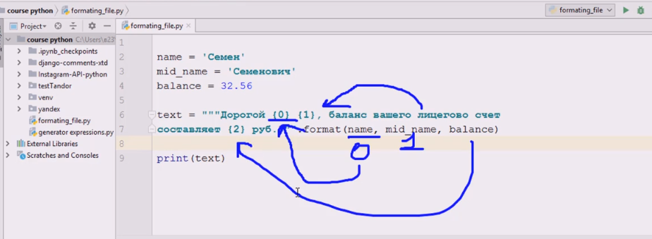

# Конкатенация

```python
name = 'Семён'
surname = 'Семёнов'
balance = 32.56

text = """Дорогой """ + name + " " + surname + """, 
баланс Вашего лицевого счёта составляет """ + str(balance) + """ руб."""

print(text)
```



# Метод format
Метод строки, поэтому его нужно вызывать только от объектов строк через точку. Метод  **`format`** автоматически преобразовывает каждое переданное значение к строке. 
## Позиционное использование метода
В этом случае порядок перечисления переменных в методе format имеет значение. От порядка переменных зависит, какие значения пойдут на какие места.




## Поименное использование метода
Во время вызова метода format нужно для каждого имени, которое используется в шаблонной строке, передать значение в следующем формате

**шаблон.format(имя1=значение1, имя2=значени2, ... , имяN=значениеN)**

В нем у нас идет следующее сопоставление имен шаблона и переменных

surname -> s
name-> n
balance-> b

```python
name = "Семён"  
surname = "Семёнович"  
balance = 37.52  

text = """Дорогой {n} {s}, баланс вашего счета составляет {b}""".format(n = name, s = surname, b = balance)  

print(text)
```


# Оператор `%` для форматирования строк
Оператор `%` используется для вставки значений в строковые шаблоны. В определенных местах вашей шаблонной строки вы указываете **специальные плейсхолдеры** (`%s`, `%d`, `%f` и др.)

```python
name = 'Семён'
surname = 'Семёнов'
balance = 32.56

print("""Дорогой %s %s, баланс счета составляет %s руб.""" % (name, surname, balance))
```

| Синтаксис | Обозначение                                     | Пример                                     |
| --------- | ----------------------------------------------- | ------------------------------------------ |
| **`%s`**  | для вставки значения в виде строки              | `"Привет, %s!" % "Аня"` → `"Привет, Аня!"` |
| **`%d`**  | для вставки значения в виде целого числа        | `"Возраст: %d" % 25` → `"Возраст: 25"`     |
| **`%f`**  | для вставки значения в виде вещественного числа | `"%.2f" % 3.14159` → `"3.14"`              |
| **`%%`**  | для вставки знака %                             | `"Процент: %d%%" % 50` → `"Процент: 50%"`  |
разницу между плейсхолдерами надо различать
```python

first = 5
second = 7
print('%s + %s = %s' % (first, second, first + second)) # 5 + 7 = 12


first = 5
second = 7
print('%d + %d = %d' % (first, second, first + second)) # 5 + 7 = 12


first = 5
second = 7
print('%f + %f = %f' % (first, second, first + second)) # 5.000000 + 7.000000 = 12.000000

```

таблица с плейсхолдерами для чисел, на примере числа 42.5678:

|   |   |   |   |
|---|---|---|---|
|**Формат**|**Описание**|**Пример (`num = 42.5678`)**|**Вывод**|
|**`%d`**|Целое число|`"%d" % num`|`42`|
|**`%5d`**|Минимум 5 символов|`"%5d" % num`|`' 42'`|
|**`%-5d`**|Выравнивание влево|`"%-5d" % num`|`'42 '`|
|`%05d`|Дополнение нулями|`"%05d" % num`|`'00042'`|
|%f|Вещественное число|`"%f" % num`|`42.567800`|
|`%.2f`|Округление до 2 знаков|`"%.2f" % num`|`42.57`|
|`%8.2f`|8 символов, 2 знака|`"%8.2f" % num`|`' 42.57'`|
|`%-8.2f`|Выравнивание влево|`"%-8.2f" % num`|`'42.57 '`|
|`%08.2f`|Дополнение нулями|`"%08.2f" % num`|`'00042.57'`|
## Настройка `%d` (целых чисел)

### 1️⃣ Минимальная ширина числа, пробелы слева.
**%Nd**
```python
num = 42
print("|%5d|" % num)  # Минимум 5 символов               - |   42|
print("|%3d|" % num)  # Минимум 3 символа                - |  42|
print("|%2d|" % num)  # Минимум 2 символа                - |42| 
print("|%1d|" % num)  # Минимум 1 символ (без изменений) - |42|
```

### 2️⃣ Минимальная ширина числа, пробелы справа.
выравнивание по левому краю
**%-Nd**
```python
num = 42
print("|%-5d|" % num)  # Минимум 5 символов               - |42   |
print("|%-3d|" % num)  # Минимум 3 символа                - |42  |
print("|%-2d|" % num)  # Минимум 2 символа                - |42|
print("|%-1d|" % num)  # Минимум 1 символ (без изменений) - |42|
```

### 3️⃣ Минимальная ширина числа, Заполнение нулями
дополняется нулями слева до минимальной длины N.
**%0Nd**
```python
num = 42
print("%05d" % num)  # Минимум 5 символов                00042
print("%04d" % num)  # Минимум 4 символа                 0042
print("%03d" % num)  # Минимум 3 символа                 042
print("%02d" % num)  # Минимум 2 символ (без изменений)  42
```

## Настройка `%f` (вещественных чисел)
### 1️⃣ Количество знаков после запятой
**сколько знаков после запятой** должно быть отображено. автоматически округляет число до нужной точности. Если у числа изначально разрядов после запятой было меньше, чем число N, то добавляются нули.

**%.Nf**
```python
pi = 3.14159
print("%.2f" % pi)  # 2 знака после запятой   3.14
print("%.4f" % pi)  # 4 знака после запятой   3.1415
print("%.8f" % pi)  # 8 знаков после запятой  3.14159000
```


### 2️⃣ Минимальная ширина и количество знаков
задать **ширину всего числа** (включая дробную часть), по следующему шаблону
**%N.Mf**, где 
- `N` — общая ширина вывода;       
- `M` — количество знаков после запятой.
```python
num = 12.34
print("|%10.2f|" % num)  # 10 символов, 2 знака после запятой - |     12.34|
print("|%6.1f|" % num)   # 6 символов, 1 знак после запятой   - |  12.3|
print("|%4.0f|" % num)   # 4 символа, без дробной части       - |  12|
```


# 1 выводит приветственное сообщение в следующем формате «Здравствуйте, <фамилия> <имя>!»
Программа запрашивает у пользователя имя и фамилию, после чего выводит приветственное сообщение в следующем формате «Здравствуйте, <фамилия> <имя>!».

```python
name = input()
surname = input()
text = "Здравствуйте, {n} {s}!".format(n = name, s = surname)
print(text)
```

# 2 считывает слово, затем выводит фразу:
Напишите программу, которая считывает слово, затем выводит фразу:

**Что Вы сказали? [это слово]? Какое интересное слово**

```python
w = input()
text = "Что Вы сказали? {0}? Какое интересное слово".format(w)
print(text)

или 

w = input()
text = "Что Вы сказали? {what}? Какое интересное слово".format(what = w)
print(text)
```

# 3 считывает целое число, и затем сообщает, какие числа будут следующим и предыдущим в определенном формате
Напишите программу, которая считывает целое число, и затем сообщает, какие числа будут следующим и предыдущим в определенном формате. Пробелы, знаки препинания, заглавные и строчные буквы важны!

```python
i = int(input())
il = i - 1
ir = i + 1
print("""Для числа {0} предыдущим будет {1}.""".format(i, il))
print("""Для числа {0} следующим будет {1}.""".format(i, ir))

```