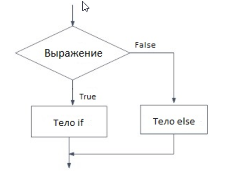

# Конструкция if

```python
if условие:
    блок команд 1
блок команд 2
```


# выражение после if
- составные условия при помощи союзов and, or, и not

- сами логические значения True/False

- результат преобразования значения к булеву типу (bool(0) = False, bool(100) = True, bool(-1) = True)

- python сам преобразует все что следует после if  к логическому значению, поэтому можно писать любую цифру (все кроме 0 - True)


# Конструкция if-else

```python
if условие:
    блок команд 1
else:
    блок команд 2
блок команд 3
```



# 1. Если это строка «Python», программа выводит `ДА`, иначе - `НЕТ`

```python
s = input
if s == "Python":
    print("ДА")
else:
    print("НЕТ")

```
Если это строка «Python», программа выводит `ДА`, в противном случае программа выводит `НЕТ`
# 2 выводит на экран сумму, оставшуюся после уплаты налога в 13%, если з.п. > 20000

```python
s = int(input)
if s < 20000:
    print(str(s))
else:
    print(str(s - (s*0.13)))
```

# 3 вывести наибольшее из двух чисел

```python
a = int(input)
b = int(input)
if a > b:
    print(str(a))
else:
    print(str(b))
```

# 4 вывести «YES» в том случае, если A + B = C, и вывести «NO» в противном случае

```python
a, b, c = map(int, input().split())
if a + b == c:
    print("YES")
else:
    print("NO")
```

# 5 удалить из списка с неповторяемыми числами `3`, `5`, `7` и `9`

```python
l = list(map(int, input().split()))
if 3 in l
    l.remove(3)
if 5 in l
    l.remove(5)
if 7 in l
    l.remove(7)
if 9 in l
    l.remove(9)
print(l)
```

# 6 Если слово `t` является словом `s`, записанным наоборот, выведите `YES`, иначе выведите `NO`.

```python
w1 = input()
w2 = input()
if w1 == w2[::-1]:
    print("YES")
else:
    print("NO")
```

# 7 является ли четырехзначное натуральное число N палиндромом

```python
t = input()
if str(t) == str(t[::-1]):
    print("YES")
else:
    print("NO")
```

# 8 определить, является ли треугольник **равнобедренным**

```python
a = int(input())
b = int(input())
c = int(input())
if a + b > c and a + c > b and c + b > a:
    if a == b or a == c or b == c:
        print("YES")
    else:
        print("NO")
else:
    print("NO")
```

# 9 написать программу, которая проверяет «счастливость» билета.
Вы пользуетесь общественным транспортом? Вероятно, вы расплачивались за проезд и получали билет с номером. Счастливым билетом называют такой билет с **шестизначным** номером (иногда и с незначащими нулями), где сумма первых трех цифр равна сумме последних трех. Т.е. билеты с номерами 385916 и 2011 – счастливые, т.к. 3+8+5=9+1+6 и 0+0+2=0+1+1. Вам требуется написать программу, которая проверяет «счастливость» билета.

Программа получает на вход одно целое число N (0 ≤ N < 106) и должна вывести «YES», если билет с номером N счастливый и «NO» в противном случае.

```python
all = []  
left = []  
right = []  
b = int(input())  
all = list(map(int, f"{b:06d}"[:]))  
left = all[:3]  
right = all[3:]  
if sum(left) == sum(right):  
    print("YES")  
else:  
    print("NO")
```

# 10 выводит сообщение о том, являются ли клетки шахматной доски клетками одного цвета

```python
cell1 = input()
cell2 = input()
if cell1.lower() == cell2.lower()
    print("YES")
if (cell1[0].lower() == 'a' or cell1[0].lower() == 'c' or cell1[0].lower() == 'e' or cell1[0].lower() == 'g') and (cell2[0].lower() == 'a' or cell2[0].lower() == 'c' or cell2[0].lower() == 'e' or cell2[0].lower() == 'g'):
```


# X

```python

```