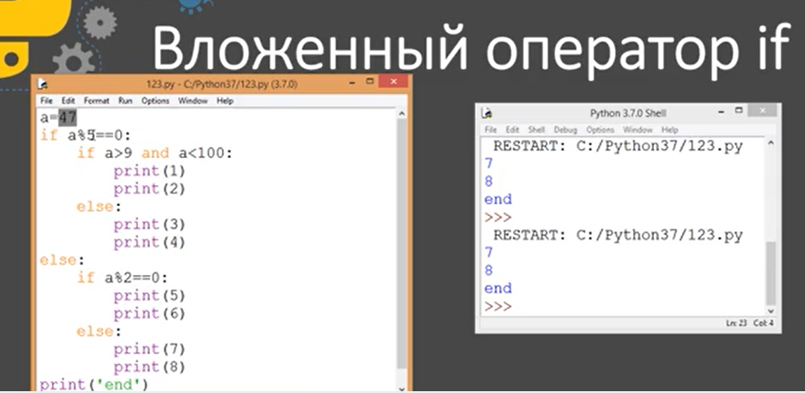

В Python четко соблюдается положение относительно отступов, которые образуют блоки кода

Ограничений по уровню вложенности нет. есть мнение или по РЕР8, что вложеных операторов должно быть не более 7 , иначе код становится трудно читаемым что не есть хорошо...

## Поиск минимального значения среди трех
```python
a = int(input())
b = int(input())
t = int(input())
if a < b:
    if a < t:
        print(a)
    else:
        print(t)
else:
    if b < t:
        print(b)
    else:
        print(t)
```

## Определение четверти по координатам точки


```python
x = int(input('Введите координату x: '))
y = int(input('Введите координату y: '))
if x > 0:  # 1 или 4 четверти
    if y > 0:
        print('1 координатная четверть')
    else:
        print('4 координатная четверть')
else:  # 2 или 3 четверти
    if y > 0:
        print('2 координатная четверть')
    else:
        print('3 координатная четверть')
```

# 1. сравни 2 числа и выведи символ сравнения

В данной задаче необходимо сравнить два целых числа A и B. Они поступают на вход программе отдельно в каждой строке.

Ваша задача — вывести символ
  ➖  `<`, если A меньше B,
  ➖  `>`, если A больше B,
  ➖  `=`, если A=B.

```python
a = int(input())
b = int(input())
sign = '='
if a>b:
    sign = '>'
if a<b:
    sign = '<'    
print(f'{sign}')
```

# 2. вывести значение наибольшего из 3 чисел
Даны три целых числа, каждое записано в отдельной строке. 
Нужно вывести значение наибольшего из данных чисел.
Примечание: используйте только условный оператор, функцией **`max`** пользоваться **нельзя.**

```python
a = int(input())
b = int(input())
c = int(input())
mx = c
if a>b:
    if a>c:
        mx = a
else:
    if b>c:
        mx = b  
print(f'{mx}')
```
# 3. охарактеризовать введенную строку по двум критериям

Программа на вход получает строку. Ваша задача - охарактеризовать введенную строку по двум критериям:

1️⃣ _четная_ или _нечетная_ (определяется по длине строки);

2️⃣ _короткая_ или _большая_ (если длина строки меньше шести символов, то такая строка считается короткой, иначе  - большой).

Обе характеристики нужно вывести в одной строке через пробел в порядке перечисления в списке.


```python
s = input()
if len(s) % 2 == 0:
    h1 = 'четная'
else:
    h1 = 'нечетная'
if len(s) < 6:
    h2 = 'короткая'
else:
    h2 = 'большая'

print(f"{h1} {h2}")

```
# 4. Лексическое сравнение строк
Маленький Петя очень любит подарки. Его мама подарила ему на день рождения две строки равной длины, состоящие из больших и маленьких букв латинского алфавита. Теперь Петя хочет сравнить эти строки лексикографически. При этом регистр букв значения не имеет, то есть большая буква считается эквивалентной соответствующей маленькой букве. Помогите Пете выполнить сравнение.
**Входные данные**
В каждой из первых двух строк записано по одной подаренной строке. Длина строк находится в пределах от 1 до 100 включительно. Гарантируется, что строки имеют одинаковую длину, а также состоят из больших и маленьких букв латинского алфавита.
**Выходные данные**
Если первая строка меньше второй, выведите «-1». Если вторая строка меньше первой, выведите «1». Если строки равны, выведите «0». Учтите, что регистр букв не учитывается при сравнении.

```python
f = input()  
s = input()  
sravn = 0  
if f.lower() == s.lower():  
    sravn = 0  
else:  
    if f.lower() < s.lower():  
        sravn = -1  
    else:  
        sravn = 1  
  
print(str(sravn))
```
# 5. наименьшее число разрезов торта по заданному числу гостей.
На свой день рождения Петя купил красивый и вкусный торт, который имел идеально круглую форму. Петя не знал, сколько гостей придет на его день рождения, поэтому вынужден был разработать алгоритм, согласно которому он сможет быстро разрезать торт на N равных частей. Следует учесть, что разрезы торта можно производить как по радиусу, так и по диаметру.
Помогите Пете решить эту задачу, определив наименьшее число разрезов торта по заданному числу гостей.

**Входные данные**
Программа получает на вход натуральное число N – число гостей, включая самого виновника торжества

**Выходные данные**
Выведите минимально возможное число разрезов торта.

```python
part = int(input())  
rez = 0  
if part > 0 and part%2 == 0:  
    rez = part / 2  
else:  
    if part == 1:  
        rez = 0  
    else:  
        rez = part  
  
print(str(int(rez)))
```
# 6. определить: на сколько зарплата самого высокооплачиваемого сотра отличается от зарплаты самого низкооплачиваемого
В отделе работают 3 сотрудника, которые получают заработную плату в рублях. Требуется определить: на сколько зарплата самого высокооплачиваемого из них отличается от зарплаты самого низкооплачиваемого.

**Входные данные**
Размеры зарплат всех сотрудников вводятся в одну строку через пробел. Каждая заработная плата – это натуральное число, не превышающее 105. И гарантируется ,что все зарплаты различны.

**Выходные данные**
Необходимо вывести одно целое число — разницу между максимальной и минимальной зарплатой.

Примечание: старайтесь не пользоваться функциями `min` и `max`, а также `сортировками`

```python
a, b, c = map(int, input().split())
mx = c
mn = c
if a > b and a > c:
	mx = a
    if b>c:
        mn = c
    else:
        mn = b
if b > a and b > c:
	mx = b
    if a>c:
        mn = c
    else:
        mn = a
if c > b and c > a:
	mx = c
    if b>a:
        mn = a
    else:
        mn = b
print(f'{mx-mn}')
```
# X Кнопочные гонки

Двое решили посоревноваться в набирании текстов на сайте «Кнопочные гонки». Во время соревнования необходимо ввести текст из _s_ символов. Первый участник набирает один символ за _v_1 миллисекунд и имеет пинг _t_1 миллисекунд. Второй участник набирает один символ за _v_2 миллисекунд и имеет пинг _t_2 миллисекунд.

При соединении с пингом (задержкой) в _t_ миллисекунд соревнование проходит для участника следующим образом:

1. Ровно через _t_ миллисекунд после начала соревнования участник получает текст, который необходимо ввести.
2. Сразу после этого он начинает вводить этот текст.
3. Ровно через _t_ миллисекунд после того, как он перепечатал весь текст, сайт получает информацию об этом.

Победителем в соревновании является тот участник, информация об успехе которого пришла раньше. Если информация пришла от обоих участников одновременно, считается, что произошла ничья.

По данной длине текста и информации об участниках, определите исход игры.

**_Входные данные_**

Первая строка содержит пять целых чисел _s_, _v_1, _v_2, _t_1, _t_2 (1 ≤ _s_, _v_1, _v_2, _t_1, _t_2 ≤ 1000) — количество символов в тексте, скорость набора текста первым участником, скорость набора текста вторым участником, пинг первого участника и пинг второго участника.

**_Выходные данные_**

Если выиграет первый участник, выведите «First». Если выиграет второй участник, выведите «Second». В случае ничьей выведите «Friendship».

```python
s, v1, v2, t1, t2 = map(int, input().split())  
T1 = 2*t1 + s*v1  
T2 = 2*t2 + s*v2  
congrat = 'Second'  
if T1 == T2:  
    congrat = 'Friendship'  
else:  
    if T1 < T2:  
        congrat = 'First'  
print(f'{congrat}')
```
# Воронеж! Тебе на «Ж»
При игре в «Города» игроки по очереди называют названия городов так, чтобы первая буква каждого нового слова совпадала с последней буквой предыдущего. При этом считают, что если последняя буква предыдущего слова — мягкий знак, то с первой буквой следующего слова надо сравнивать букву, предшествующую мягкому знаку.

Напишите программу, которая считывает подряд две строки, после чего выводит «Good», если последний символ первой строки совпадает с первым символом второй (с учётом правила про мягкий знак), и «Bad» в противном случае.
```python
t1 = input()  
t2 = input()  
congrat = 'Good'  
if t1[-1].lower() == 'ь':  
    if t1[-2].lower() != t2[0].lower():  
        congrat = 'Bad'  
else:  
    if t1[-1].lower() != t2[0].lower():  
        congrat = 'Bad'  
print(f'{congrat}')
```

# задание вне курса
```python
q1 = input('Хотите много зарабатывать (Д/Н)?')  
if q1.lower() == 'н':  
    print('Delphy')  
else:  
    q11 = input('Вы тупой (Д/Н)?')  
    if q11.lower() == 'н':  
        q110 = input('Вы инженер (Д/Н)?')  
        if q110.lower() == 'н':  
            q1100 = input('У вас есит ноги (Д/Н)?')  
            if q1100.lower() == 'н':  
                print('C')  
            else:  
                q11001 = input('А они вам нужны (Д/Н)?')  
                if q11001.lower() == 'н':  
                    print('C++')  
                else:  
                    print('Java')  
        else:  
            q1101 = input('Вам больше 50 (Д/Н)?')  
            if q1101.lower() == 'н':  
                print('Matlab')  
            else:  
                print('Fortran')  
    else:  
        q111 = input('Очень (Д/Н)?')  
        if q111.lower() == 'н':  
            q1110 = input('Вы несмотрелись урокув ХАУДИ ХО (Д/Н)?')  
            if q1110.lower() == 'н':  
                q11100 = input('Вам нравится Windows (Д/Н)?')  
                if q11100.lower() == 'н':  
                    q111000 = input('Вы пи*р (Д/Н)?')  
                    if q111000.lower() == 'н':  
                        print('Perl')  
                    else:  
                        print('Swift')  
                else:  
                    print('C#')  
            else:  
                print('Python')  
        else:  
            q1111 = input('У вас есть друзья (Д/Н)?')  
            if q1111.lower() == 'н':  
                print('PHP')  
            else:  
                q11111 = input('Они тоже тупые (Д/Н)?')  
                if q11111.lower() == 'н':  
                    print('Ruby')  
                else:  
                    print('JavaScript')
```