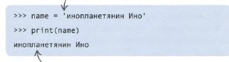
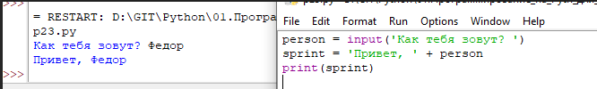

Строки можно хранить в переменных. Строки надо взять в кавычки, можно в двойные


Если переменные со строками сложить - получаем составную строку, и тут уже важно есть ли пробелы в складываемых строках
```
person = input('Как тебя зовут? ')
sprint = 'Привет, ' + person
print(sprint)
```

