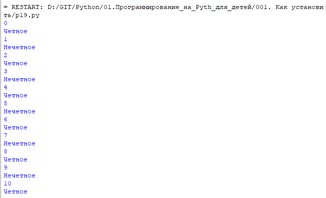

диапазон значаний: в скобках указываем начальное значение, конечное значение.
Начальное значение можно опустить, тогда это будет 0
```
for сounter in range(11):
    print(сounter)
    if (сounter % 2) == 0:
        print('Четное')
    else:
        print('Нечетное')	
```

