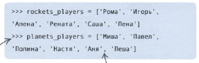
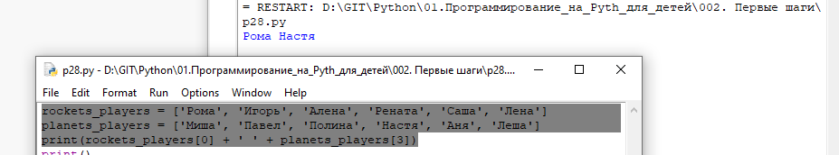

Список - некий массив значений, к которому можно обращаться по индексу (счет идет с 0). Задаем в скобках **[ ]**, через запятую

Обращаемся к элементу списка по индексу
```
rockets_players = ['Рома', 'Игорь', 'Алена', 'Рената', 'Саша', 'Лена']
planets_players = ['Миша', 'Павел', 'Полина', 'Настя', 'Аня', 'Леша']
print(rockets_players[0])
print(planets_players[1])
```

или так:
```
rockets_players = ['Рома', 'Игорь', 'Алена', 'Рената', 'Саша', 'Лена']
planets_players = ['Миша', 'Павел', 'Полина', 'Настя', 'Аня', 'Леша']
print(rockets_players[0] + ' ' + planets_players[3])
```

