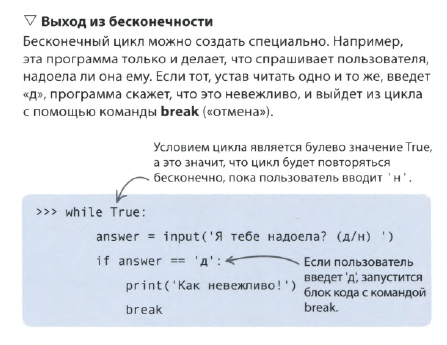

Оператор является способом выхода из бесконечного цикла **WHILE**
```python
while True:
    answer = input('Печатаю пока не нажмешь клавишу (н) ')
    if answer == 'н':
	    print('Я так и знал')
	    break
    
```


Второй способ выйти из зацикливания - нажать **ctrl+C**