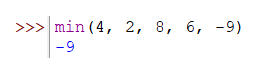
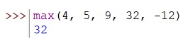

Функция **`min()`** - принимает на вход несколько значений через запятую и находит наименьшее из них. 


Функция **`max()`** - принимает на вход несколько значений через запятую и находит наибольшее из них. 



```python
print(max(10, 3, 76, 3, 90))  # 90
print(min(3.2, 3.9, 7.6, 2, 1.9))  # 1.9
```
