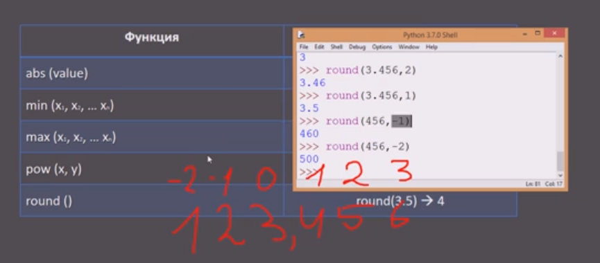

Функция **`round`** необходима, чтобы выполнить округление. Если передать ей одно значение, то округление будет выполнено по умолчанию до целого числа. У функции **`round`** есть особенность - она использует банковское округление, а не обычное правило округления. По правилам банковского округления пограничные случаи, такие как 4.5 или 9.5, округляются не вверх, а в сторону ближайшего четного числа. Вот почему round(4.5) будет равно 4, а round(9.5) вернет значение 10.


```python
print(round(3457.5678))  # 3458 - округление по разряду единиц
print(round(3457.5678, 0))  # 3458.0 - округление по разряду единиц
print(round(3457.5678, 1))  # 3457.6 - округление по десятые
print(round(3457.5678, 2))  # 3457.57 - округление по сотые
print(round(3457.5678, 3))  # 3457.568 - округление по тысячные

print(round(3457.5678, -1))  # 3460.0 - округление по разряду десятков
print(round(3457.5678, -2))  # 3500.0 - округление по разряду сотен
print(round(3457.5678, -3))  # 3000.0 - округление по разряду тысяч
```

Также в функцию `round` можно передать второе значение через запятую для указания разряда, по которому нужно будет выполнить округление. Допустимы как положительные, так и отрицательные значения. Положительные значения отвечают за разряды, расположенные после точки в дробной части (например, 1=десятые, 2=сотые, 3=тысячные и т.д.). Отрицательными обозначаются разряды, расположенные до точки (-1=десятки, -2=сотни, -3=тысячи и т.д.) К примеру, если передать функции `round()` вторым значением -1, то она округлит ее до первого знака до запятой (до десятков):

