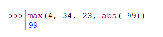
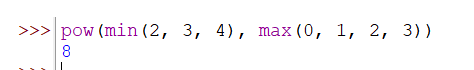

Внутри функций вы можете использовать другие функции: сначала вычисляются выражения в скобках, их называют внутренние или вложенные вызовы. Лишь только после этого находится результат внешней функции.



Еще пример



```python
pow(min(2,3,4), max(0,1,2,3))   #8
```
